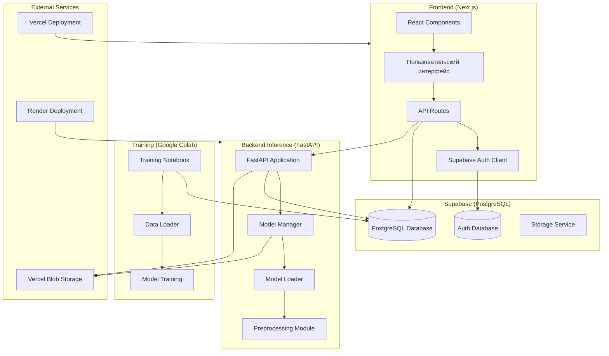
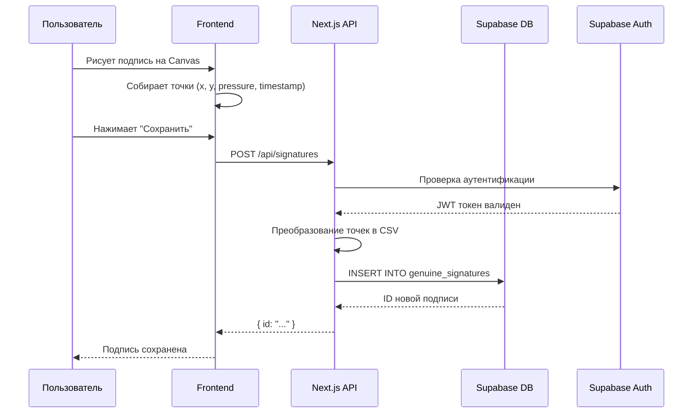
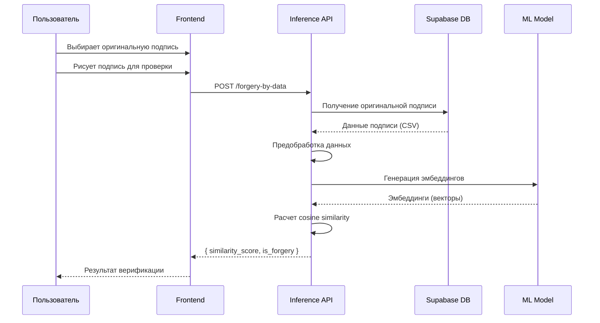
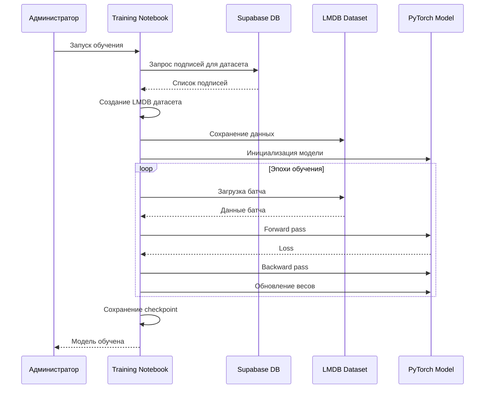

# Архитектура системы Your Sign AI

## Общая архитектура

Your Sign AI представляет собой распределенную систему, состоящую из трех основных компонентов, взаимодействующих через базу данных Supabase и внешние сервисы.

## Компоненты системы

### 1. Frontend (Next.js)

**Расположение**: `site/`

**Основные модули**:
- **UI Components** (`components/`) - React компоненты для интерфейса
- **API Routes** (`app/api/`) - Next.js API endpoints
- **Pages** (`app/`) - страницы приложения
- **Lib** (`lib/`) - утилиты, клиенты, типы

**Технологии**:
- Next.js 16 с App Router
- React 19
- TypeScript
- Tailwind CSS
- Supabase Auth для аутентификации

### 2. Backend Inference (FastAPI)

**Расположение**: `inference/`

**Основные модули**:
- **Routes** (`routes/`) - API endpoints
- **Utils** (`utils/`) - утилиты (model_loader, preprocessing, supabase_client)
- **Models** (`models/`) - определения моделей PyTorch
- **Dependencies** (`dependencies.py`) - FastAPI dependencies

**Технологии**:
- FastAPI
- PyTorch для ML inference
- Uvicorn как ASGI сервер
- Mangum для Vercel serverless

### 3. Training (Google Colab)

**Расположение**: `training/`

**Основные модули**:
- **Training** (`src/training/`) - логика обучения
- **Models** (`src/models/`) - архитектуры моделей
- **Data** (`src/data/`) - загрузка и обработка данных
- **Config** (`src/config.py`) - конфигурация обучения

**Технологии**:
- PyTorch
- Google Colab
- LMDB для хранения датасета

### 4. Database (Supabase)

**Расположение**: `supabase/`

**Основные таблицы**:
- `profiles` - профили пользователей
- `genuine_signatures` - подлинные подписи
- `forged_signatures` - поддельные подписи
- `embeddings` - эмбеддинги подписей
- `models` - информация о ML моделях
- `pseudousers` - псевдопользователи для внешних данных

**Особенности**:
- Row Level Security (RLS) для безопасности
- Расширение `vector` для хранения эмбеддингов
- Триггеры для автоматического обновления метаданных

## Потоки данных

### Поток создания подписи

### Поток верификации подписи

### Поток обучения модели

## Технологический стек

### Frontend
- **Framework**: Next.js 16 (App Router)
- **UI Library**: React 19
- **Language**: TypeScript
- **Styling**: Tailwind CSS
- **UI Components**: Radix UI
- **Authentication**: Supabase Auth
- **State Management**: React Hooks
- **Testing**: Jest, Playwright

### Backend
- **Framework**: FastAPI
- **ML Framework**: PyTorch
- **ASGI Server**: Uvicorn
- **Serverless**: Mangum (для Vercel)
- **Database Client**: Supabase Python Client
- **Storage**: Vercel Blob Storage (production)

### Database
- **Database**: PostgreSQL (Supabase)
- **Extensions**: `uuid-ossp`, `vector`
- **Security**: Row Level Security (RLS)
- **Auth**: Supabase Auth

### Training
- **Framework**: PyTorch
- **Environment**: Google Colab
- **Data Format**: LMDB
- **Loss Functions**: Triplet Loss, Contrastive Loss

### Deployment
- **Frontend**: Vercel
- **Backend**: Render (основной) или Vercel Serverless Functions (альтернатива)
- **Database**: Supabase Cloud
- **Storage**: Vercel Blob Storage

## Безопасность

### Аутентификация и авторизация
- JWT токены через Supabase Auth
- Row Level Security (RLS) в PostgreSQL
- Роли пользователей: `user`, `mod`, `admin`
- Service role ключи для backend операций

### Защита данных
- Хеширование токенов админов (SHA256)
- Валидация входных данных (Zod, Pydantic)
- CORS настройки для API
- HTTPS в production

## Масштабируемость

### Frontend
- Serverless функции Vercel
- Статическая генерация страниц где возможно
- Кэширование API запросов

### Backend
- Stateless API сервер
- Hotswap моделей без downtime
- Асинхронная обработка запросов

### Database
- Индексы на часто используемых полях
- Партиционирование больших таблиц (при необходимости)
- Connection pooling

## Мониторинг и логирование

### Логирование
- Frontend: Console logs, Vercel Analytics
- Backend: Python logging, Uvicorn access logs
- Database: Supabase logs

### Мониторинг
- Health check endpoints
- Vercel Analytics для фронтенда
- Supabase Dashboard для БД

## Дополнительные ресурсы

- [Схема базы данных](DATABASE.md)
- [Frontend документация](frontend/README.md)
- [Inference документация](inference/README.md)
- [Training документация](training/README.md)

