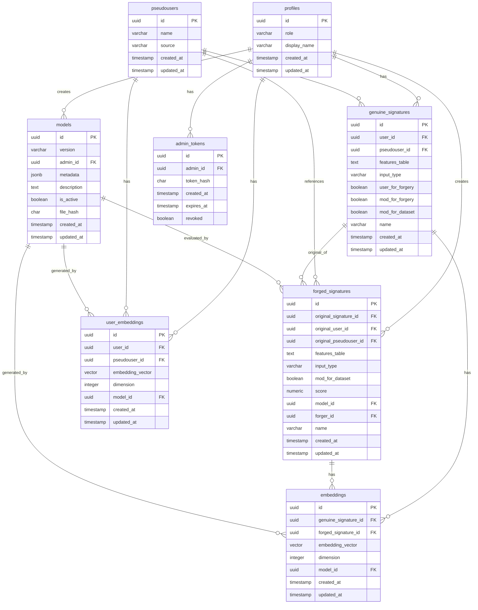

# Схема базы данных

## Обзор

База данных Your Sign AI использует PostgreSQL через Supabase с расширениями для работы с UUID и векторными данными. Схема спроектирована для хранения пользователей, подписей (подлинных и поддельных), эмбеддингов и информации о ML моделях.

## ER-диаграмма



## Таблицы

### profiles

Профили пользователей системы. Связана 1:1 с `auth.users` из Supabase Auth.

**Поля**:
- `id` (UUID, PK) - ID пользователя, ссылается на `auth.users.id`
- `role` (VARCHAR(20)) - Роль: `user`, `mod`, `admin`
- `display_name` (VARCHAR(64)) - Отображаемое имя
- `created_at` (TIMESTAMP) - Дата создания
- `updated_at` (TIMESTAMP) - Дата обновления

**Ограничения**:
- `role` должен быть одним из: `user`, `mod`, `admin`
- `id` уникален и не может совпадать с `pseudousers.id`

**RLS политики**:
- Пользователи могут видеть только свой профиль
- Модераторы могут видеть все профили
- Администраторы имеют полный доступ

### pseudousers

Псевдопользователи для внешних подписей (например, из публичных датасетов).

**Поля**:
- `id` (UUID, PK) - ID псевдопользователя
- `name` (VARCHAR(64)) - Имя псевдопользователя
- `source` (VARCHAR(64)) - Источник данных (например, "DeepSignDB", "SigComp")
- `created_at` (TIMESTAMP) - Дата создания
- `updated_at` (TIMESTAMP) - Дата обновления

**RLS политики**:
- Доступ только для модераторов и администраторов

### genuine_signatures

Подлинные подписи пользователей.

**Поля**:
- `id` (UUID, PK) - ID подписи
- `user_id` (UUID, FK) - ID пользователя (nullable)
- `pseudouser_id` (UUID, FK) - ID псевдопользователя (nullable)
- `features_table` (TEXT) - Данные подписи в формате CSV
- `input_type` (VARCHAR(20)) - Тип ввода: `mouse`, `touch`, `pen`
- `user_for_forgery` (BOOLEAN) - Флаг пользователя для использования в подделках
- `mod_for_forgery` (BOOLEAN) - Флаг модератора для использования в подделках
- `mod_for_dataset` (BOOLEAN) - Флаг для использования в датасете обучения
- `name` (VARCHAR(128)) - Название подписи
- `created_at` (TIMESTAMP) - Дата создания
- `updated_at` (TIMESTAMP) - Дата обновления

**Ограничения**:
- Должен быть указан либо `user_id`, либо `pseudouser_id` (но не оба)
- `input_type` должен быть одним из: `mouse`, `touch`, `pen`

**RLS политики**:
- Пользователи могут видеть только свои подписи
- Модераторы имеют доступ ко всем подписям (кроме других модераторов/админов)
- Администраторы имеют полный доступ

### forged_signatures

Поддельные подписи.

**Поля**:
- `id` (UUID, PK) - ID поддельной подписи
- `original_signature_id` (UUID, FK) - ID оригинальной подписи
- `original_user_id` (UUID, FK) - ID владельца оригинальной подписи
- `original_pseudouser_id` (UUID, FK) - ID псевдопользователя оригинальной подписи
- `features_table` (TEXT) - Данные подписи в формате CSV
- `input_type` (VARCHAR(20)) - Тип ввода
- `mod_for_dataset` (BOOLEAN) - Флаг для использования в датасете
- `score` (NUMERIC(7,4)) - Оценка качества подделки
- `model_id` (UUID, FK) - ID модели, использованной для оценки
- `forger_id` (UUID, FK) - ID пользователя, создавшего подделку
- `name` (VARCHAR(128)) - Название
- `created_at` (TIMESTAMP) - Дата создания
- `updated_at` (TIMESTAMP) - Дата обновления

**Ограничения**:
- Должен быть указан либо `original_user_id`, либо `original_pseudouser_id`

**RLS политики**:
- Доступ только для модераторов и администраторов

### embeddings

Эмбеддинги подписей (векторные представления).

**Поля**:
- `id` (UUID, PK) - ID эмбеддинга
- `genuine_signature_id` (UUID, FK) - ID подлинной подписи (nullable)
- `forged_signature_id` (UUID, FK) - ID поддельной подписи (nullable)
- `embedding_vector` (VECTOR(512)) - Вектор эмбеддинга
- `dimension` (INTEGER) - Размерность вектора
- `model_id` (UUID, FK) - ID модели, сгенерировавшей эмбеддинг
- `created_at` (TIMESTAMP) - Дата создания
- `updated_at` (TIMESTAMP) - Дата обновления

**Ограничения**:
- Должен быть указан либо `genuine_signature_id`, либо `forged_signature_id`

**RLS политики**:
- Пользователи могут видеть эмбеддинги своих подписей
- Модераторы имеют полный доступ

### user_embeddings

Средние эмбеддинги пользователей (агрегированные из всех их подписей).

**Поля**:
- `id` (UUID, PK) - ID эмбеддинга
- `user_id` (UUID, FK) - ID пользователя (nullable)
- `pseudouser_id` (UUID, FK) - ID псевдопользователя (nullable)
- `embedding_vector` (VECTOR(512)) - Вектор эмбеддинга
- `dimension` (INTEGER) - Размерность
- `model_id` (UUID, FK) - ID модели
- `created_at` (TIMESTAMP) - Дата создания
- `updated_at` (TIMESTAMP) - Дата обновления

**RLS политики**:
- Пользователи могут видеть только свои эмбеддинги
- Модераторы имеют полный доступ

### models

Информация о ML моделях.

**Поля**:
- `id` (UUID, PK) - ID модели
- `version` (VARCHAR(20)) - Версия модели (например, "v1", "v2")
- `admin_id` (UUID, FK) - ID администратора, загрузившего модель
- `metadata` (JSONB) - Метаданные модели
- `description` (TEXT) - Описание модели
- `is_active` (BOOLEAN) - Активна ли модель на inference сервере
- `file_hash` (CHAR(64)) - SHA256 хеш файла модели
- `created_at` (TIMESTAMP) - Дата создания
- `updated_at` (TIMESTAMP) - Дата обновления

**RLS политики**:
- Все аутентифицированные пользователи могут читать
- Только администраторы могут изменять

### admin_tokens

Токены администраторов для API доступа.

**Поля**:
- `id` (UUID, PK) - ID токена
- `admin_id` (UUID, FK) - ID администратора
- `token_hash` (CHAR(64)) - SHA256 хеш токена
- `created_at` (TIMESTAMP) - Дата создания
- `expires_at` (TIMESTAMP) - Дата истечения (nullable)
- `revoked` (BOOLEAN) - Отозван ли токен

**RLS политики**:
- Администраторы могут видеть только свои токены
- Service role имеет полный доступ

## Связи между таблицами

### Основные связи

1. **profiles ↔ genuine_signatures**: Один пользователь может иметь много подписей
2. **genuine_signatures ↔ forged_signatures**: Одна подпись может быть оригиналом для многих подделок
3. **genuine_signatures ↔ embeddings**: Одна подпись может иметь несколько эмбеддингов (от разных моделей)
4. **models ↔ embeddings**: Одна модель генерирует много эмбеддингов
5. **profiles ↔ models**: Администратор может загрузить несколько моделей

### Ограничения целостности

- **CASCADE DELETE**: При удалении пользователя удаляются его подписи и эмбеддинги
- **SET NULL**: При удалении модели, ссылки на неё в других таблицах устанавливаются в NULL
- **UNIQUE ID**: `profiles.id` и `pseudousers.id` не могут совпадать

## RLS (Row Level Security) политики

### Принципы безопасности

1. **Пользователи** (`user`):
   - Видят только свои данные
   - Могут создавать свои подписи
   - Не могут видеть данные других пользователей

2. **Модераторы** (`mod`):
   - Видят все данные обычных пользователей
   - Не могут видеть данные других модераторов и администраторов
   - Могут управлять флагами для датасета

3. **Администраторы** (`admin`):
   - Полный доступ ко всем данным
   - Могут управлять моделями
   - Могут управлять пользователями

4. **Service Role**:
   - Полный доступ для backend операций
   - Используется inference сервером

### Функции безопасности

- `is_mod()` - Проверка роли модератора из JWT
- `is_admin()` - Проверка роли администратора из JWT
- `get_user_email()` - Получение email пользователя

## Индексы

### Основные индексы

```sql
-- Внешние ключи
CREATE INDEX idx_models_admin_id ON models(admin_id);
CREATE INDEX idx_genuine_signatures_user_id ON genuine_signatures(user_id);
CREATE INDEX idx_forged_signatures_original_signature_id ON forged_signatures(original_signature_id);
CREATE INDEX idx_forged_signatures_model_id ON forged_signatures(model_id);
CREATE INDEX idx_embeddings_genuine_signature_id ON embeddings(genuine_signature_id);
CREATE INDEX idx_embeddings_forged_signature_id ON embeddings(forged_signature_id);
CREATE INDEX idx_user_embeddings_user_id ON user_embeddings(user_id);
```

### Оптимизация запросов

- Индексы на внешних ключах для быстрых JOIN операций
- Индексы на часто используемых полях фильтрации
- Векторные индексы для поиска по эмбеддингам (при необходимости)

## Триггеры

### Автоматическое обновление

1. **`trigger_update_updated_at_column()`**: Автоматически обновляет `updated_at` при изменении записи
2. **`set_user_role_in_metadata()`**: Обновляет метаданные пользователя в JWT при изменении роли
3. **`check_unique_id_across_tables()`**: Проверяет уникальность ID между `profiles` и `pseudousers`

## RPC функции

### Полезные функции

1. **`get_random_forgery_signature()`**: Получение случайной подписи для создания подделки
2. **`get_input_type_stats()`**: Статистика по типам ввода подписей
3. **`get_user_email()`**: Получение email пользователя по ID профиля

## Миграции

Миграции находятся в `supabase/migrations/`:

- `000_base_schema.sql` - Базовая схема
- `001_unique_id_constraint.sql` - Ограничение уникальности ID
- `002_input_type_stats.sql` - Статистика по типам ввода

## Дополнительные ресурсы

- [Полная схема SQL](supabase/schema.sql)
- [Миграции](supabase/migrations/)
- [Frontend типы](site/lib/types.ts)

