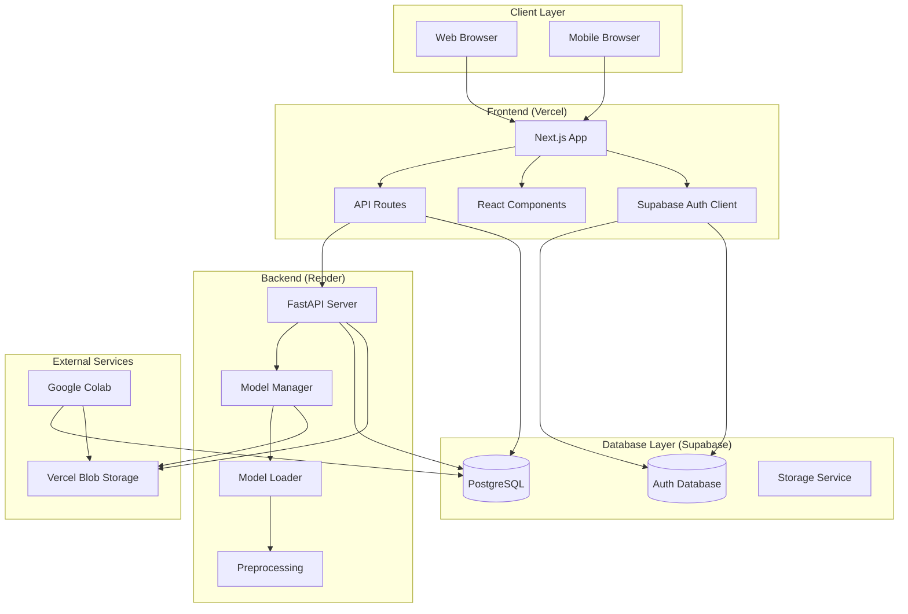
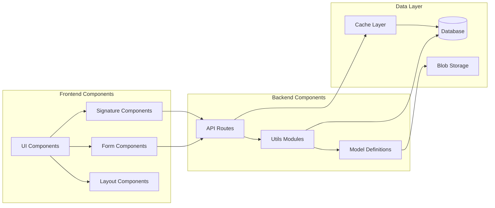
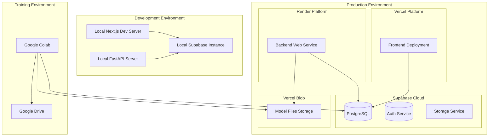
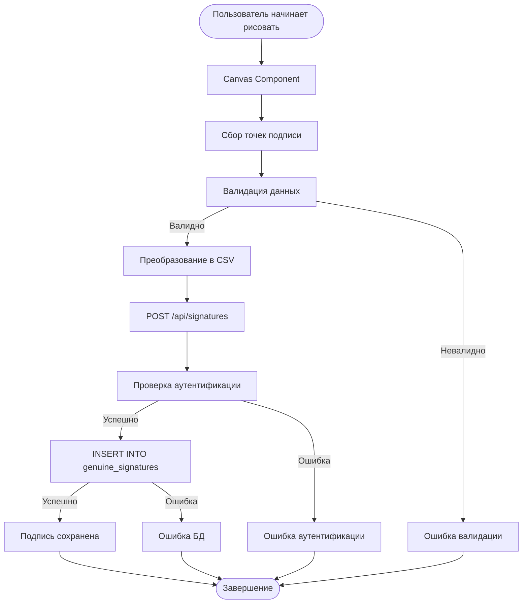
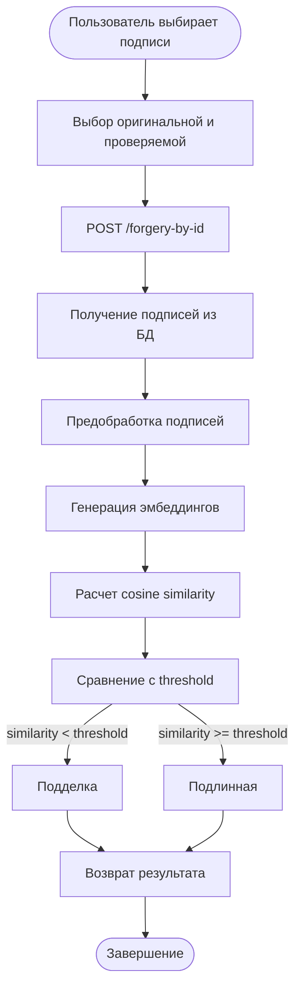
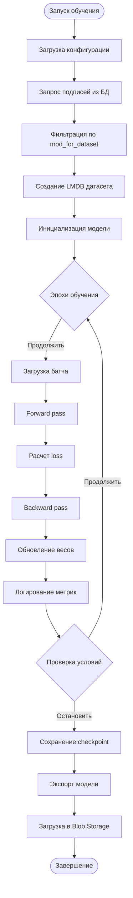
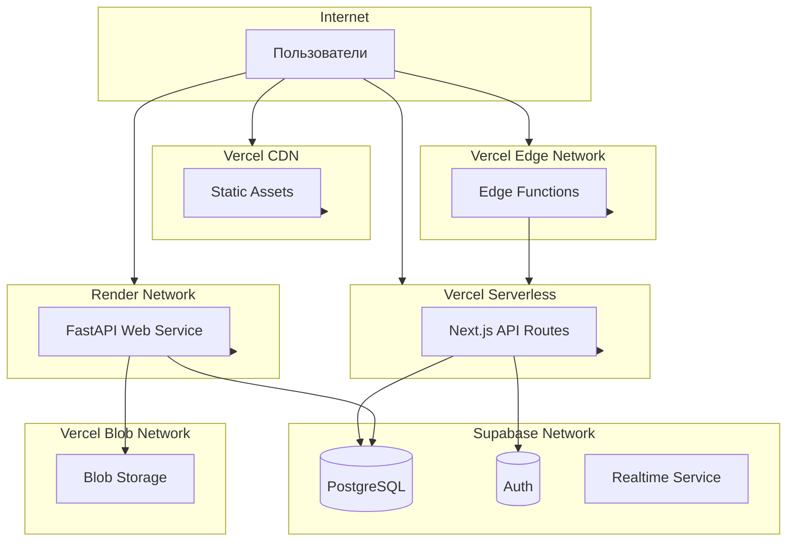
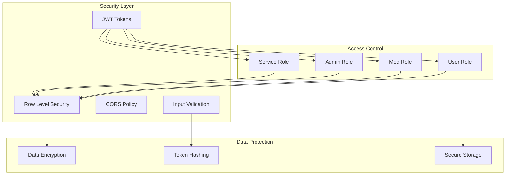
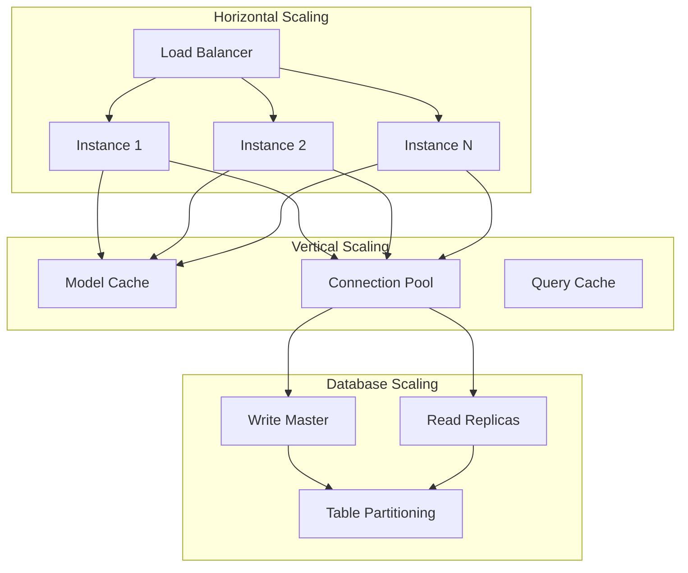

# Architecture диаграммы

## Общая архитектура системы

## Компонентная диаграмма

## Deployment архитектура

## Data Flow: Создание подписи

## Data Flow: Верификация подписи

## Data Flow: Обучение модели

## Сетевая архитектура

## Безопасность и доступ

## Масштабируемость

