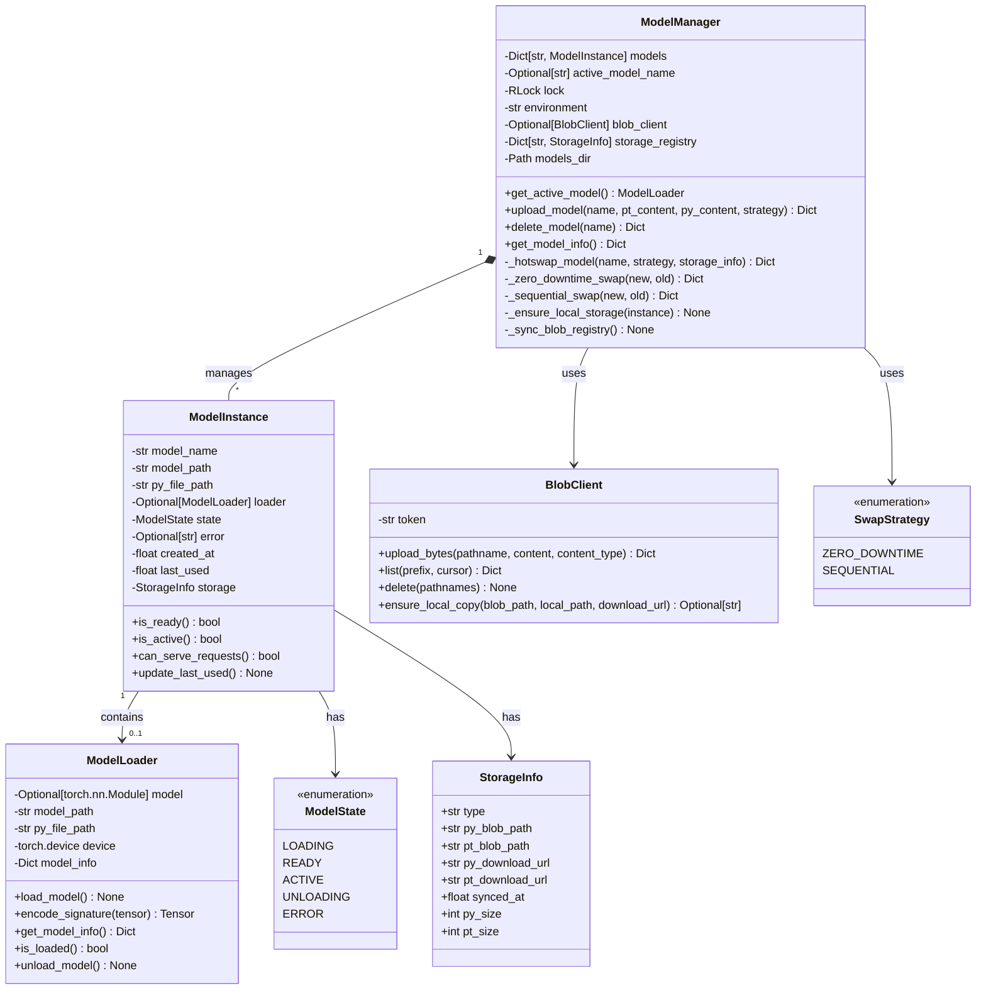
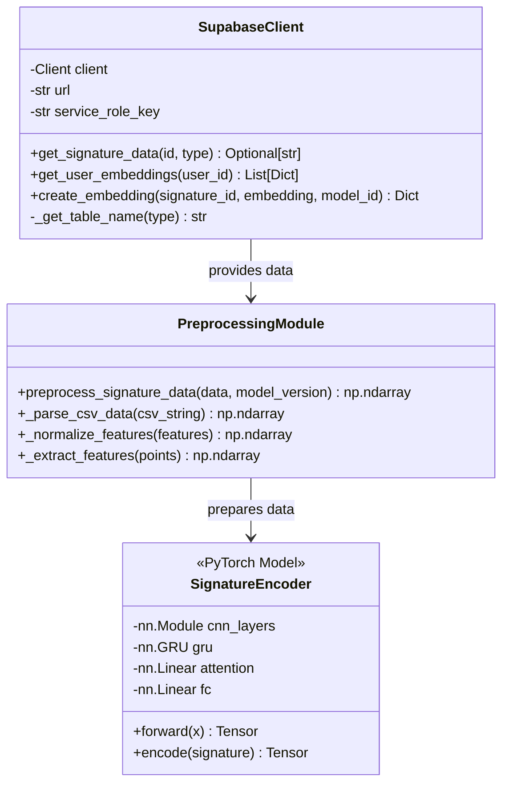
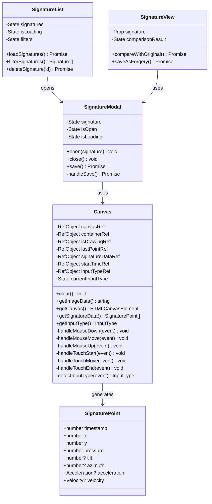
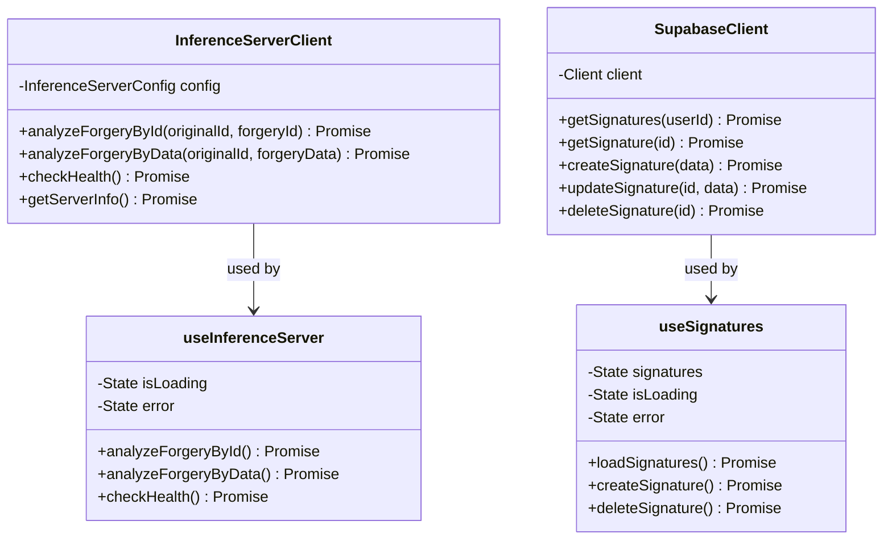
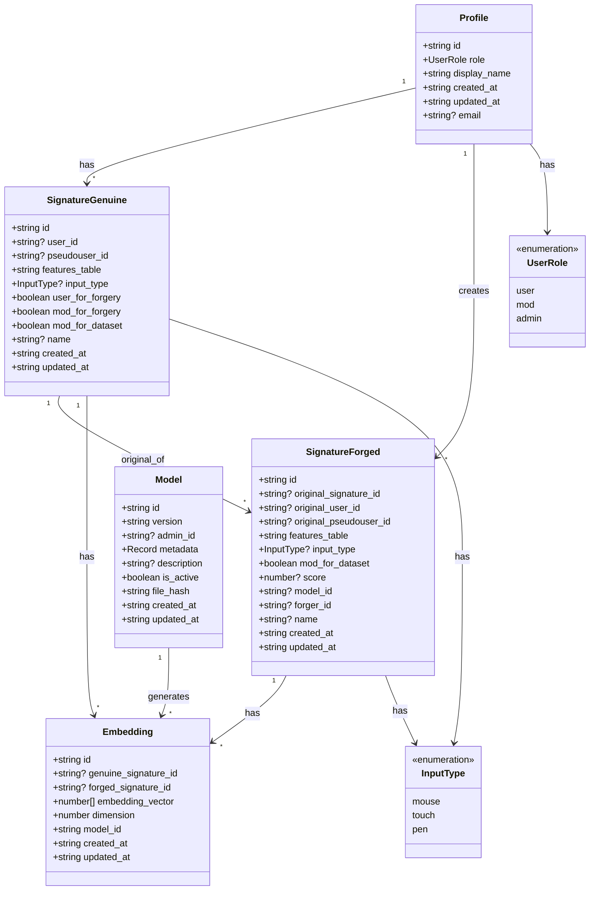
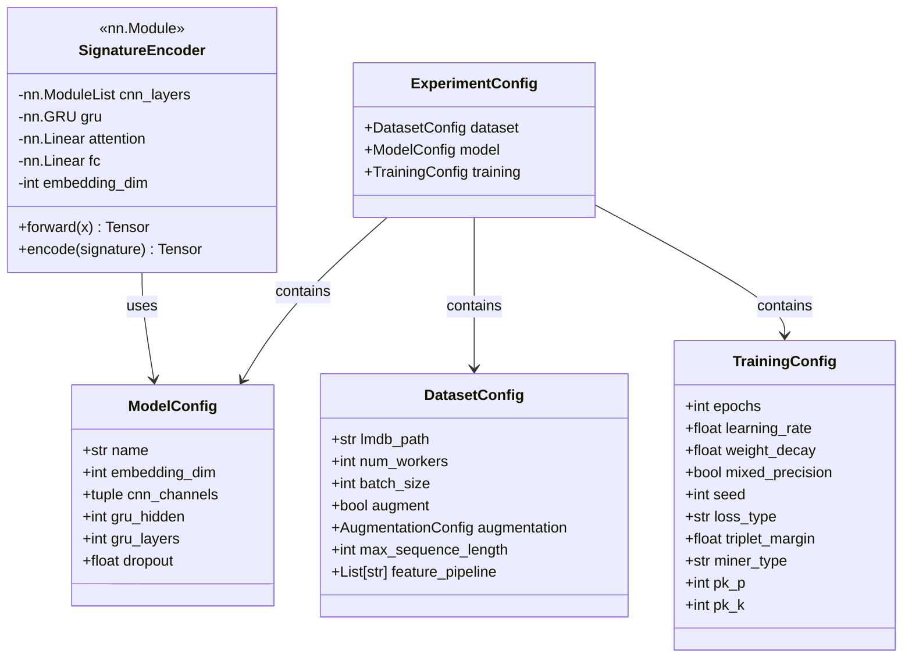
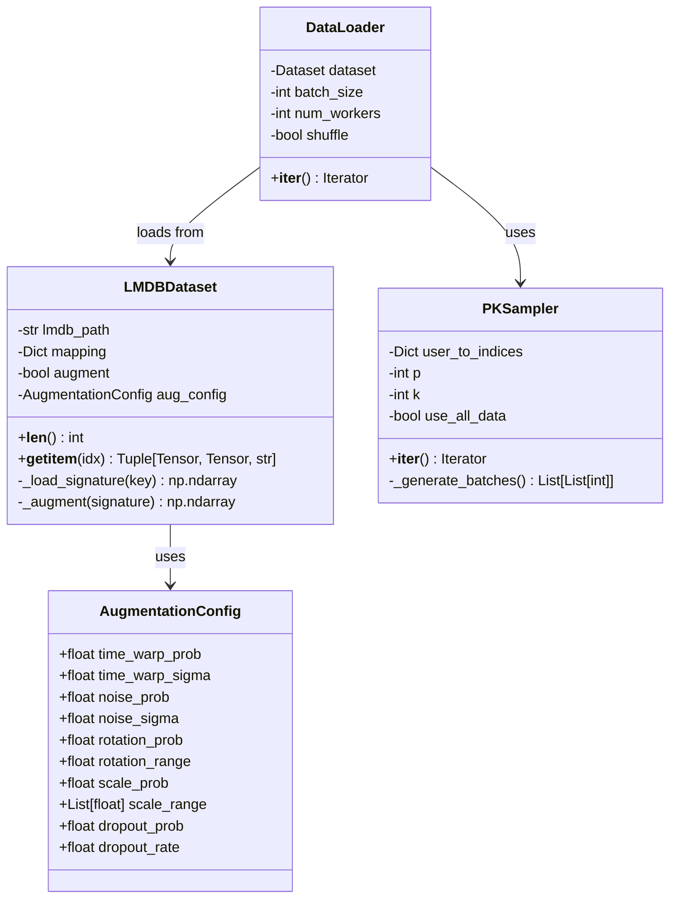
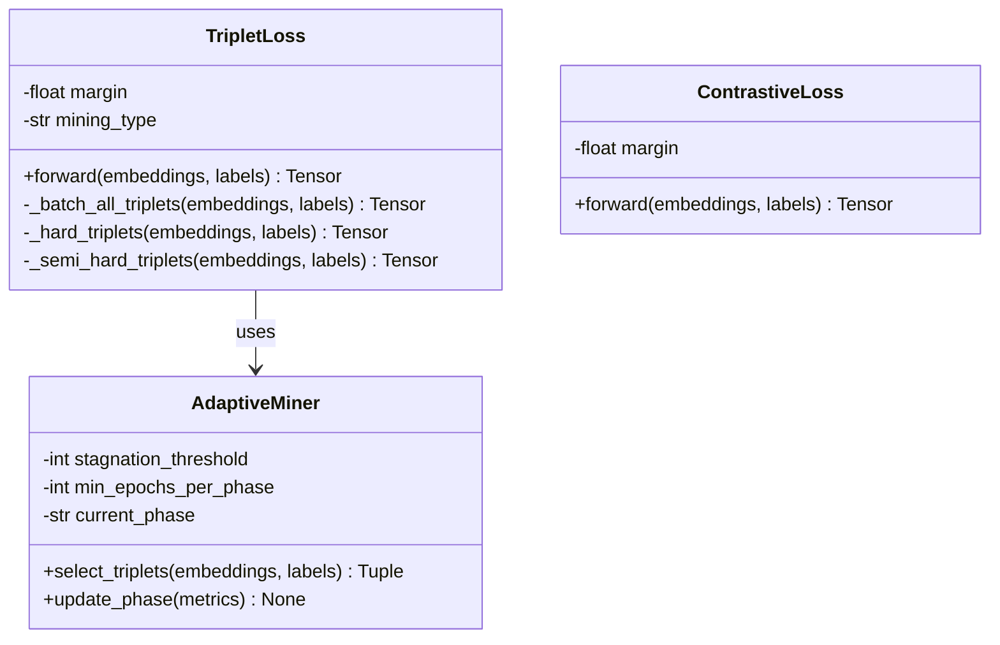
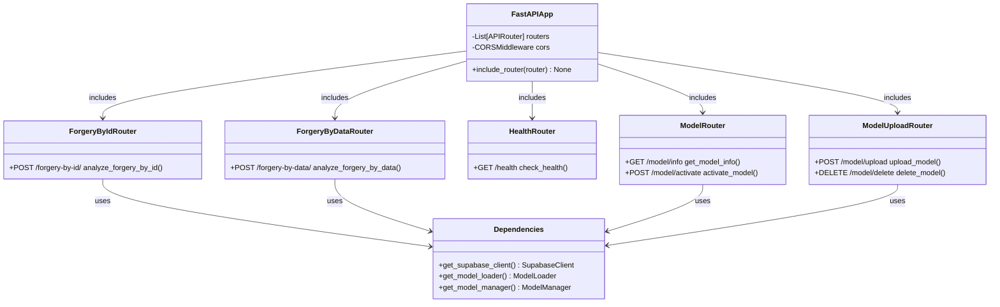

# Class диаграммы

## Обзор

Class диаграммы описывают структуру классов и их взаимосвязи в различных компонентах системы.

## Backend: Model Manager и связанные классы

## Backend: Supabase Client и Preprocessing

## Frontend: Signature Components

## Frontend: API Clients и Hooks

## Database: TypeScript Types

## Training: Model Architecture

## Training: Data Loading

## Training: Loss Functions

## FastAPI: Routes и Dependencies

## Взаимосвязи между компонентами

### Backend → Frontend
- `InferenceServerClient` взаимодействует с FastAPI endpoints
- `SupabaseClient` взаимодействует с Supabase через REST API

### Backend → Database
- `SupabaseClient` выполняет SQL запросы через Supabase Python client
- RLS политики применяются автоматически на уровне БД

### Training → Database
- Training notebook загружает данные через Supabase client
- Создает LMDB датасет для эффективной загрузки

### Model Management
- `ModelManager` управляет жизненным циклом моделей
- `ModelLoader` загружает и выполняет inference
- `BlobClient` синхронизирует модели между storage и сервером

