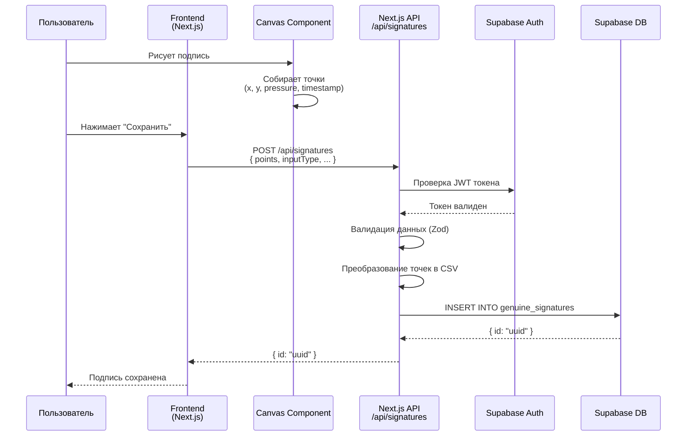
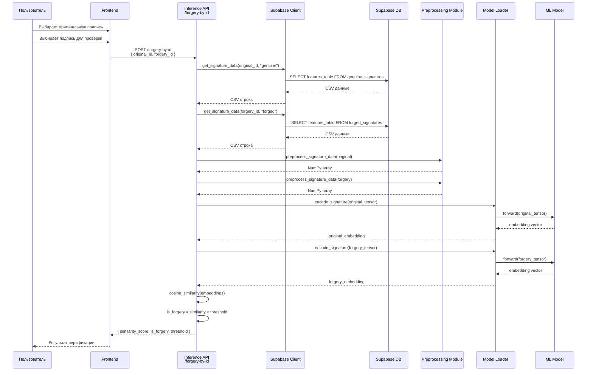
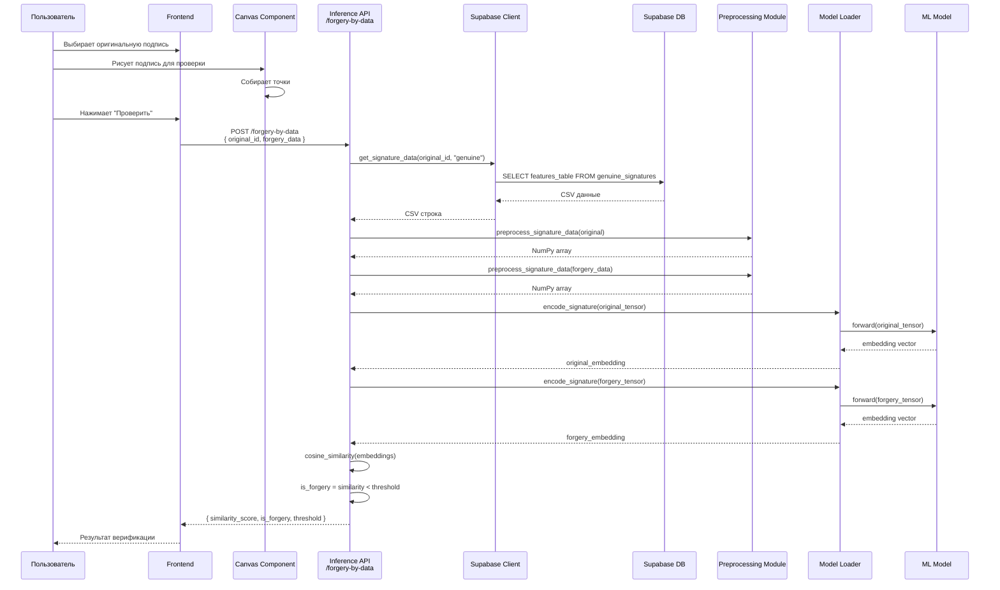
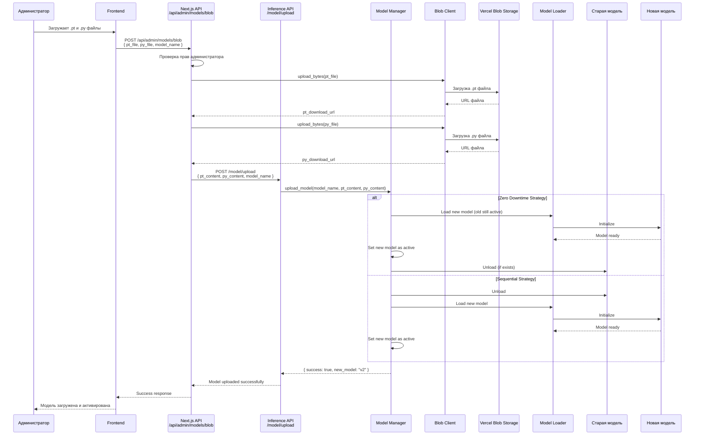
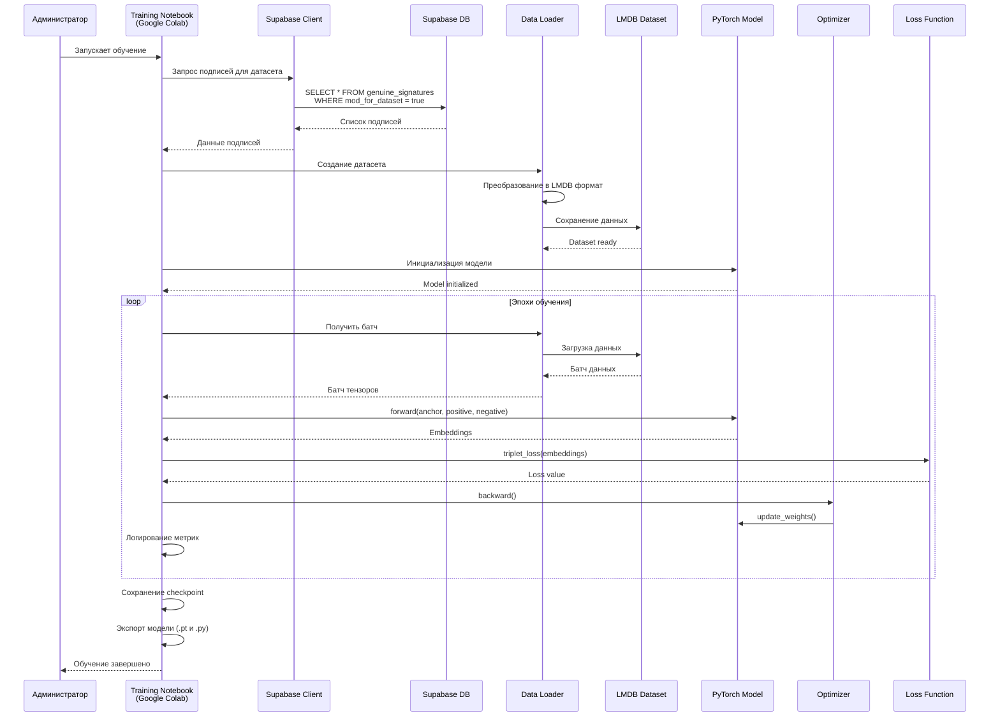
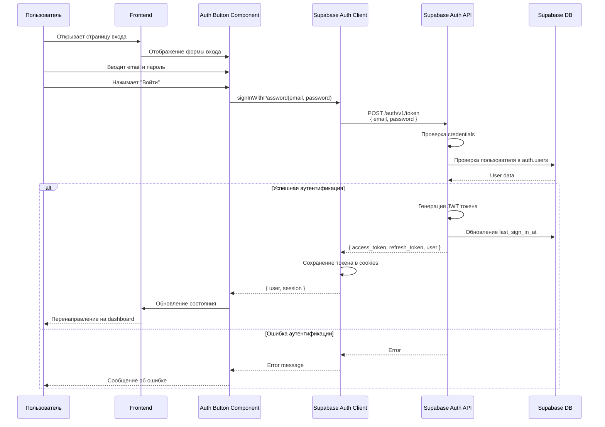
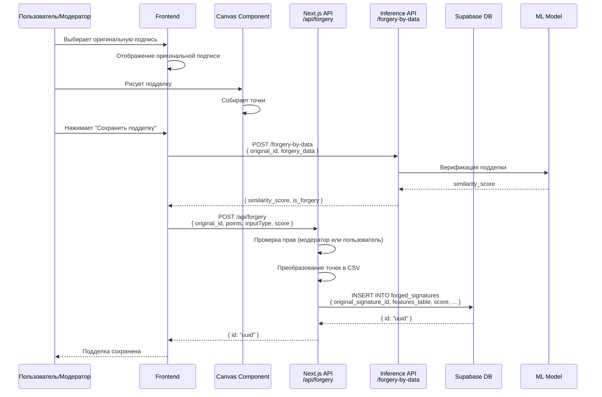
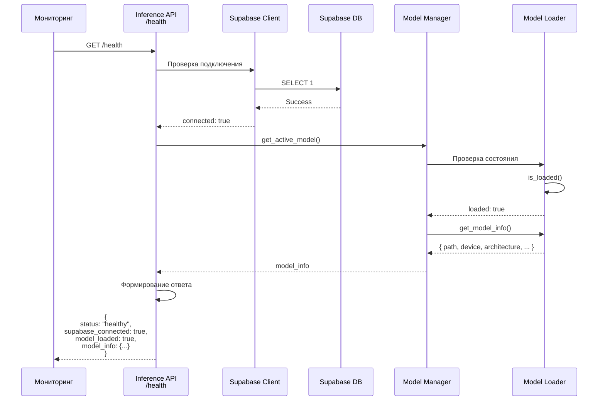

# Sequence диаграммы

## Обзор

Sequence диаграммы описывают последовательность взаимодействий между компонентами системы при выполнении различных операций.

## Создание подписи

## Верификация подписи (по ID)

## Верификация подписи (по данным)

## Загрузка модели (Hotswap)

## Обучение модели

## Аутентификация пользователя

## Создание подделки

## Health Check

