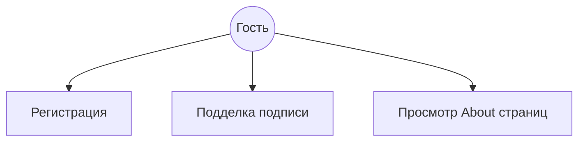
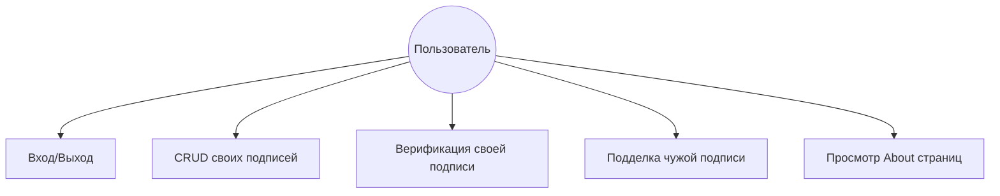
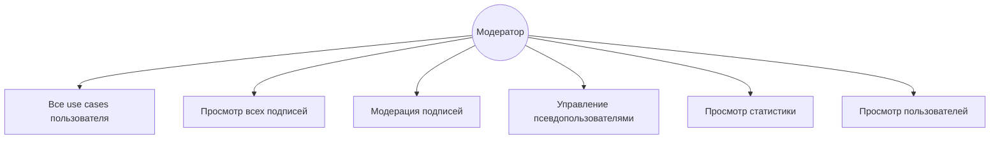
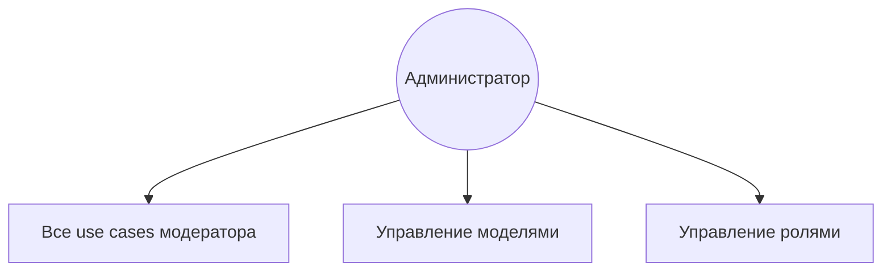
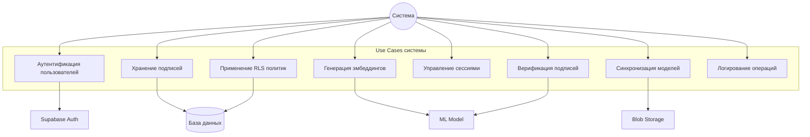
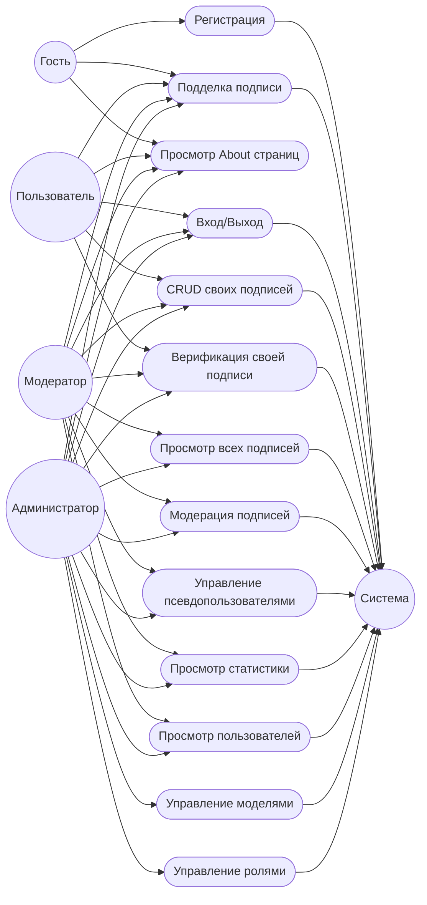

# Use Case диаграммы

## Обзор
## Use Case для гостя (Guest)

**Описание use cases для гостя**:

1. **Регистрация** – Гость может создать новый аккаунт в системе.
2. **Подделка подписи** – Гость может попробовать подделать подпись без сохранения результата.

Use case диаграммы описывают функциональность системы с точки зрения различных ролей пользователей.

## Use Case для пользователя (User)

**Описание use cases для пользователя**:

1. **Регистрация** - Создание нового аккаунта в системе
2. **Вход в систему** - Аутентификация существующего пользователя
3. **Создание подписи** - Рисование и сохранение цифровой подписи
4. **Просмотр своих подписей** - Просмотр списка всех своих подписей
5. **Верификация подписи** - Сравнение новой подписи с оригиналом
6. **Удаление своей подписи** - Удаление сохраненной подписи
7. **Настройка профиля** - Изменение отображаемого имени
8. **Выход из системы** - Завершение сессии

## Use Case для модератора (Moderator)

**Описание use cases для модератора**:

1. **Все use cases пользователя** - Модератор имеет все права обычного пользователя
2. **Просмотр всех подписей** - Доступ ко всем подписям обычных пользователей
3. **Модерация подписей** - Управление флагами `mod_for_forgery` и `mod_for_dataset`
4. **Управление флагами для датасета** - Определение, какие подписи использовать для обучения
5. **Управление псевдопользователями** - Создание и управление псевдопользователями для внешних данных
6. **Просмотр статистики** - Статистика по типам ввода, количеству подписей и т.д.
7. **Создание подделок** - Создание поддельных подписей для обучения модели
8. **Просмотр пользователей** - Просмотр списка всех пользователей

## Use Case для администратора (Admin)

**Описание use cases для администратора**:

1. **Все use cases модератора** - Администратор имеет все права модератора
2. **Управление моделями** - Просмотр списка всех моделей и их статусов
3. **Загрузка новой модели** - Загрузка новых версий ML моделей (.pt и .py файлы)
4. **Активация модели** - Переключение активной модели на inference сервере
5. **Управление пользователями** - Просмотр и управление пользователями
6. **Изменение ролей** - Назначение ролей пользователям (user, mod, admin)
7. **Создание admin токенов** - Генерация токенов для API доступа
8. **Мониторинг системы** - Просмотр состояния системы, health checks
9. **Просмотр всех данных** - Полный доступ ко всем данным в системе

## Use Case для системы (System)

**Описание use cases системы**:

1. **Аутентификация пользователей** - Проверка JWT токенов, управление сессиями
2. **Хранение подписей** - Сохранение данных подписей в базе данных
3. **Генерация эмбеддингов** - Создание векторных представлений подписей через ML модель
4. **Верификация подписей** - Сравнение подписей и определение подлинности
5. **Управление сессиями** - Создание и валидация сессий пользователей
6. **Применение RLS политик** - Обеспечение безопасности данных через Row Level Security
7. **Синхронизация моделей** - Синхронизация моделей между Blob Storage и inference сервером
8. **Логирование операций** - Запись логов всех операций в системе

## Общая Use Case диаграмма

## Взаимосвязи между use cases

### Включение (Include)
- **Верификация подписи** включает **Генерацию эмбеддингов**
- **Создание подписи** включает **Аутентификацию**
- **Загрузка модели** включает **Синхронизацию с Blob Storage**

### Расширение (Extend)
- **Модерация подписей** расширяет **Просмотр подписей**
- **Управление моделями** расширяет **Мониторинг системы**

## Приоритеты use cases

### Высокий приоритет (MVP)
- Регистрация и вход
- Создание подписи
- Просмотр подписей
- Верификация подписи
- Управление моделями (для админов)

### Средний приоритет
- Модерация подписей
- Управление флагами для датасета
- Статистика
- Мониторинг системы

### Низкий приоритет
- Управление псевдопользователями
- Admin токены
- Расширенная аналитика

