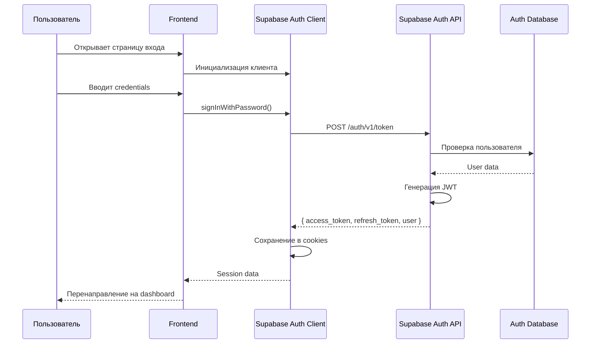

# Аутентификация

## Обзор

Система аутентификации Your Sign AI использует Supabase Auth для управления пользователями, сессиями и авторизацией. Поддерживаются регистрация, вход, восстановление пароля и управление сессиями.

## Архитектура аутентификации



## Роли пользователей

### User (Пользователь)
- Базовый доступ
- Создание и просмотр своих подписей
- Верификация подписей

### Mod (Модератор)
- Все права пользователя
- Просмотр всех подписей обычных пользователей
- Модерация подписей
- Управление флагами для датасета
- Управление псевдопользователями

### Admin (Администратор)
- Все права модератора
- Управление моделями
- Управление пользователями и ролями
- Полный доступ ко всем данным

## Компоненты аутентификации

### AuthButton

**Расположение**: `components/auth/auth-button.tsx`

**Описание**: Универсальная кнопка для входа/выхода.

**Поведение**:
- Для неавторизованных: показывает кнопку "Войти"
- Для авторизованных: показывает меню с именем пользователя и кнопкой "Выйти"

### LoginForm

**Расположение**: `components/forms/login-form.tsx`

**Поля**:
- Email
- Password
- Ссылка "Забыли пароль?"

**Валидация**:
```typescript
const loginSchema = z.object({
  email: z.string().email('Неверный email'),
  password: z.string().min(6, 'Минимум 6 символов'),
});
```

### SignUpForm

**Расположение**: `components/forms/sign-up-form.tsx`

**Поля**:
- Email
- Password
- Confirm Password
- Display Name

**Валидация**:
```typescript
const signUpSchema = z.object({
  email: z.string().email(),
  password: z.string().min(6),
  confirmPassword: z.string(),
  displayName: z.string().min(2).max(64),
}).refine((data) => data.password === data.confirmPassword, {
  message: "Пароли не совпадают",
  path: ["confirmPassword"],
});
```

## Supabase Auth Client

### Инициализация

**Client-side**:
```typescript
import { createBrowserClient } from '@supabase/ssr';

const supabase = createBrowserClient(
  process.env.NEXT_PUBLIC_SUPABASE_URL!,
  process.env.NEXT_PUBLIC_SUPABASE_ANON_KEY!
);
```

**Server-side**:
```typescript
import { createServerClient } from '@supabase/ssr';
import { cookies } from 'next/headers';

const supabase = createServerClient(
  process.env.NEXT_PUBLIC_SUPABASE_URL!,
  process.env.NEXT_PUBLIC_SUPABASE_ANON_KEY!,
  {
    cookies: {
      get(name: string) {
        return cookies().get(name)?.value;
      },
    },
  }
);
```

## Операции аутентификации

### Регистрация

```typescript
const { data, error } = await supabase.auth.signUp({
  email: 'user@example.com',
  password: 'password123',
  options: {
    data: {
      display_name: 'User Name',
    },
  },
});
```

После регистрации создается запись в `auth.users` и автоматически создается профиль в таблице `profiles`.

### Вход

```typescript
const { data, error } = await supabase.auth.signInWithPassword({
  email: 'user@example.com',
  password: 'password123',
});
```

### Выход

```typescript
const { error } = await supabase.auth.signOut();
```

### Восстановление пароля

```typescript
const { data, error } = await supabase.auth.resetPasswordForEmail(
  'user@example.com',
  {
    redirectTo: 'http://localhost:3000/auth/update-password',
  }
);
```

### Обновление пароля

```typescript
const { data, error } = await supabase.auth.updateUser({
  password: 'newPassword123',
});
```

## Проверка аутентификации

### Client-side

```typescript
import { useAuth } from '@/lib/hooks/use-auth';

function MyComponent() {
  const { user, isLoading } = useAuth();
  
  if (isLoading) return <div>Загрузка...</div>;
  if (!user) return <div>Не авторизован</div>;
  
  return <div>Привет, {user.email}!</div>;
}
```

### Server-side

```typescript
import { getUser } from '@/lib/utils/auth-server-utils';

export async function GET() {
  const user = await getUser();
  
  if (!user) {
    return NextResponse.json(
      { error: 'Unauthorized' },
      { status: 401 }
    );
  }
  
  // ... логика
}
```

## Проверка ролей

### Client-side

```typescript
import { useProfile } from '@/lib/hooks/use-profile';

function AdminComponent() {
  const { profile, isLoading } = useProfile();
  
  if (profile?.role !== 'admin') {
    return <div>Доступ запрещен</div>;
  }
  
  return <div>Административная панель</div>;
}
```

### Server-side

```typescript
import { isMod, isAdmin } from '@/lib/utils/auth-server-utils';

export async function POST(req: NextRequest) {
  const user = await getUser();
  
  if (!(await isAdmin(user))) {
    return NextResponse.json(
      { error: 'Forbidden' },
      { status: 403 }
    );
  }
  
  // ... логика для администратора
}
```

## Защита маршрутов

### Middleware

**Расположение**: `middleware.ts` (в корне проекта)

```typescript
import { createServerClient } from '@supabase/ssr';
import { NextResponse, type NextRequest } from 'next/server';

export async function middleware(request: NextRequest) {
  const supabase = createServerClient(
    process.env.NEXT_PUBLIC_SUPABASE_URL!,
    process.env.NEXT_PUBLIC_SUPABASE_ANON_KEY!,
    {
      cookies: {
        get(name: string) {
          return request.cookies.get(name)?.value;
        },
      },
    }
  );

  const {
    data: { user },
  } = await supabase.auth.getUser();

  // Защита защищенных маршрутов
  if (!user && request.nextUrl.pathname.startsWith('/dashboard')) {
    return NextResponse.redirect(new URL('/auth/login', request.url));
  }

  return NextResponse.next();
}
```

### Защита на уровне страниц

```typescript
import { redirect } from 'next/navigation';
import { getUser } from '@/lib/utils/auth-server-utils';

export default async function DashboardPage() {
  const user = await getUser();
  
  if (!user) {
    redirect('/auth/login');
  }
  
  // ... рендер страницы
}
```

## JWT токены

Supabase Auth использует JWT токены для аутентификации. Токены содержат:
- `sub` - ID пользователя
- `email` - Email пользователя
- `user_metadata` - Метаданные (включая роль)
- `exp` - Время истечения

### Обновление роли в JWT

При изменении роли пользователя в таблице `profiles`, триггер автоматически обновляет `raw_user_meta_data` в `auth.users`, что отражается в JWT токене.

## Service Role

Для операций, требующих повышенных прав (например, создание подписей от имени других пользователей), используется service role client.

```typescript
import { createServiceClient } from '@/lib/supabase/service';

const supabaseSR = createServiceClient();
// Этот клиент обходит RLS политики
```

**Важно**: Service role client должен использоваться только на сервере и никогда не должен быть доступен на клиенте.

## Безопасность

### Best Practices

1. **Никогда не передавайте service role key на клиент**
2. **Всегда валидируйте входные данные**
3. **Используйте HTTPS в production**
4. **Регулярно обновляйте зависимости**
5. **Используйте RLS политики для защиты данных**

### Защита от атак

- **CSRF**: Защита через SameSite cookies
- **XSS**: Санитизация входных данных
- **SQL Injection**: Использование параметризованных запросов через Supabase client
- **Brute Force**: Ограничение попыток входа (настроено в Supabase)

## Обработка ошибок

### Типичные ошибки

```typescript
const { data, error } = await supabase.auth.signInWithPassword({
  email: 'user@example.com',
  password: 'wrongpassword',
});

if (error) {
  switch (error.message) {
    case 'Invalid login credentials':
      // Неверный email или пароль
      break;
    case 'Email not confirmed':
      // Email не подтвержден
      break;
    default:
      // Другая ошибка
  }
}
```

## Дополнительные ресурсы

- [Supabase Auth Documentation](https://supabase.com/docs/guides/auth)
- [Next.js Authentication](https://nextjs.org/docs/app/building-your-application/authentication)
- [API Routes](API_ROUTES.md)

