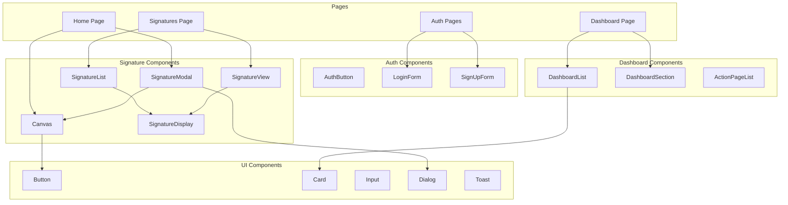

# Frontend Components

## Обзор компонентов

Frontend приложение состоит из множества переиспользуемых компонентов, организованных по функциональности.

## Диаграмма компонентов



## Signature Components

### Canvas

**Расположение**: `components/signature/canvas.tsx`

**Описание**: Компонент для рисования цифровых подписей. Поддерживает мышь, сенсорный экран и графический планшет.

**Props**:
```typescript
interface CanvasProps {
  className?: string;
  canvasClassName?: string;
  showInputTypeIcon?: boolean;
}
```

**Ref методы**:
- `clear()` - Очистка canvas
- `getImageData()` - Получение изображения в base64
- `getCanvas()` - Получение HTMLCanvasElement
- `getSignatureData()` - Получение массива точек подписи
- `getInputType()` - Получение типа ввода (mouse/touch/pen)

**Особенности**:
- Автоматическое определение типа ввода
- Сбор данных о давлении (для планшетов)
- Поддержка разных размеров canvas (responsive)

### SignatureModal

**Расположение**: `components/signature/signature-modal.tsx`

**Описание**: Модальное окно для создания и просмотра подписей.

**Функции**:
- Создание новой подписи
- Просмотр существующей подписи
- Сохранение подписи
- Сравнение подписей

### SignatureList

**Расположение**: `components/signature/signature-list.tsx`

**Описание**: Список подписей с фильтрацией и пагинацией.

**Функции**:
- Отображение списка подписей
- Фильтрация по типу, дате
- Пагинация
- Удаление подписей

### SignatureView

**Расположение**: `components/signature/signature-view.tsx`

**Описание**: Детальный просмотр подписи с возможностью сравнения.

**Функции**:
- Отображение информации о подписи
- Сравнение с другой подписью
- Сохранение как подделка
- Верификация через inference API

### SignatureDisplay

**Расположение**: `components/signature/signature-display.tsx`

**Описание**: Компонент для отображения сохраненной подписи.

**Props**:
```typescript
interface SignatureDisplayProps {
  signature: Signature;
  showInfo?: boolean;
  size?: 'small' | 'medium' | 'large';
}
```

## Auth Components

### AuthButton

**Расположение**: `components/auth/auth-button.tsx`

**Описание**: Кнопка входа/выхода с отображением статуса пользователя.

**Функции**:
- Отображение кнопки входа для неавторизованных
- Отображение меню пользователя для авторизованных
- Выход из системы

### LoginForm

**Расположение**: `components/forms/login-form.tsx`

**Описание**: Форма входа в систему.

**Поля**:
- Email
- Password
- "Забыли пароль?" ссылка

**Валидация**: Zod schema

### SignUpForm

**Расположение**: `components/forms/sign-up-form.tsx`

**Описание**: Форма регистрации нового пользователя.

**Поля**:
- Email
- Password
- Confirm Password
- Display Name

**Валидация**: Zod schema

## Dashboard Components

### DashboardList

**Расположение**: `components/dashboard/dashboard-list.tsx`

**Описание**: Навигационный список для дашборда.

**Функции**:
- Отображение доступных разделов
- Навигация между страницами
- Адаптация под роль пользователя

### DashboardSection

**Расположение**: `components/dashboard/dashboard-section.tsx`

**Описание**: Секция дашборда с заголовком и контентом.

**Props**:
```typescript
interface DashboardSectionProps {
  title: string;
  description?: string;
  children: React.ReactNode;
}
```

### ActionPageList

**Расположение**: `components/dashboard/dashboard-action-list.tsx`

**Описание**: Список действий для модераторов и администраторов.

**Функции**:
- Быстрый доступ к действиям
- Отображение только для соответствующих ролей

## Layout Components

### MobileNavigation

**Расположение**: `components/layout/mobile-navigation.tsx`

**Описание**: Мобильная навигация с выдвижным меню.

**Функции**:
- Адаптивное меню для мобильных устройств
- Интеграция с DashboardList

### ThemeSwitcher

**Расположение**: `components/layout/theme-switcher.tsx`

**Описание**: Переключатель темы (светлая/темная).

**Функции**:
- Переключение между темами
- Сохранение выбора пользователя
- Использование next-themes

## UI Components

### Button

**Расположение**: `components/ui/button.tsx`

**Описание**: Переиспользуемая кнопка с вариантами стилей.

**Варианты**:
- `default` - Основная кнопка
- `destructive` - Опасное действие
- `outline` - Контурная кнопка
- `ghost` - Прозрачная кнопка
- `link` - Ссылка-кнопка

### Card

**Расположение**: `components/ui/card.tsx`

**Описание**: Карточка для группировки контента.

**Составные части**:
- `CardHeader` - Заголовок
- `CardTitle` - Заголовок карточки
- `CardDescription` - Описание
- `CardContent` - Контент
- `CardFooter` - Футер

### Input

**Расположение**: `components/ui/input.tsx`

**Описание**: Поле ввода с валидацией.

**Особенности**:
- Интеграция с формами
- Валидация через Zod
- Обработка ошибок

### Dialog

**Расположение**: `components/ui/alert-dialog.tsx`

**Описание**: Модальное окно для подтверждений и диалогов.

**Использование**:
- Подтверждение удаления
- Информационные диалоги
- Формы в модальных окнах

### Toast

**Расположение**: `components/ui/toast.tsx`

**Описание**: Уведомления для пользователя.

**Типы**:
- `success` - Успешная операция
- `error` - Ошибка
- `warning` - Предупреждение
- `info` - Информация

## Hooks

### useSignatures

**Расположение**: `lib/hooks/use-signatures.tsx`

**Описание**: Хук для работы с подписями.

**Функции**:
- `loadSignatures()` - Загрузка подписей
- `createSignature()` - Создание подписи
- `deleteSignature()` - Удаление подписи
- `updateSignature()` - Обновление подписи

### useInferenceServer

**Расположение**: `lib/inference-client.ts`

**Описание**: Хук для работы с inference API.

**Функции**:
- `analyzeForgeryById()` - Анализ по ID
- `analyzeForgeryByData()` - Анализ по данным
- `checkHealth()` - Проверка состояния сервера

### useAuth

**Расположение**: `lib/hooks/use-auth.tsx`

**Описание**: Хук для работы с аутентификацией.

**Функции**:
- `signIn()` - Вход
- `signUp()` - Регистрация
- `signOut()` - Выход
- `user` - Текущий пользователь

## Утилиты

### signature-utils

**Расположение**: `lib/utils/signature-utils.ts`

**Функции**:
- `prepareGenuineSignatureDataForInsert()` - Подготовка данных для вставки
- `parseSignatureCSV()` - Парсинг CSV данных подписи
- `formatSignaturePoints()` - Форматирование точек

### auth-server-utils

**Расположение**: `lib/utils/auth-server-utils.ts`

**Функции**:
- `getUser()` - Получение пользователя из сессии
- `isMod()` - Проверка роли модератора
- `isAdmin()` - Проверка роли администратора

## Стилизация

### Tailwind CSS

Проект использует Tailwind CSS для стилизации. Конфигурация находится в `tailwind.config.ts`.

### Темы

Поддерживаются светлая и темная темы через `next-themes`. Переключение через `ThemeSwitcher` компонент.

### Responsive Design

Компоненты адаптивны и работают на:
- Мобильных устройствах (< 640px)
- Планшетах (640px - 1024px)
- Десктопах (> 1024px)

## Дополнительные ресурсы

- [API Routes](API_ROUTES.md)
- [Аутентификация](AUTHENTICATION.md)
- [Захват подписей](SIGNATURE_CAPTURE.md)

