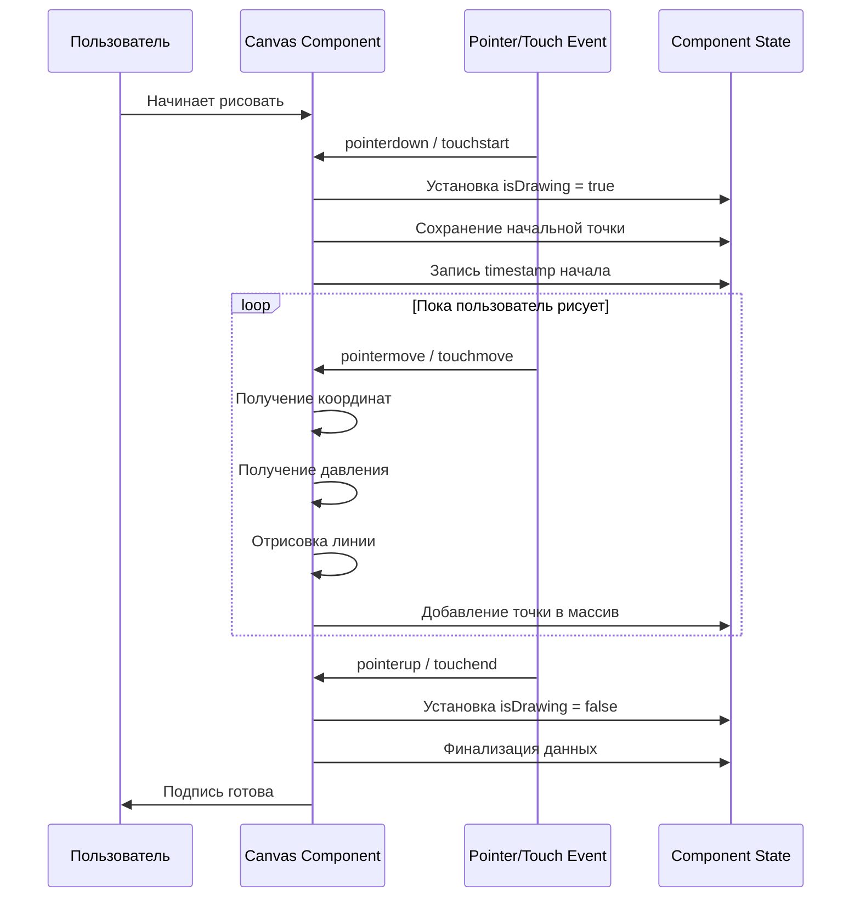

# Захват подписей

## Обзор

Система захвата подписей позволяет пользователям создавать цифровые подписи с помощью мыши, сенсорного экрана или графического планшета. Данные собираются в формате временных рядов с координатами, давлением и дополнительными метриками.

## Canvas компонент

### Описание

Canvas компонент (`components/signature/canvas.tsx`) является основным компонентом для захвата подписей. Он использует HTML5 Canvas API для отрисовки и сбора данных о движении указателя.

### Поддерживаемые устройства ввода

1. **Мышь** (`mouse`)
   - Координаты x, y
   - Временные метки
   - Давление = 0.5 (по умолчанию)

2. **Сенсорный экран** (`touch`)
   - Координаты x, y
   - Временные метки
   - Давление из touch event (если доступно)

3. **Графический планшет** (`pen`)
   - Координаты x, y
   - Временные метки
   - Давление из pointer event
   - Наклон (tilt) - если доступно
   - Азимут (azimuth) - если доступно

## Формат данных подписи

### SignaturePoint

```typescript
interface SignaturePoint {
  timestamp: number;      // Время в миллисекундах от начала
  x: number;             // X координата
  y: number;             // Y координата
  pressure: number;      // Давление (0.0 - 1.0)
  tilt?: number;         // Наклон пера (опционально)
  azimuth?: number;      // Азимут пера (опционально)
  acceleration?: {       // Ускорение (опционально)
    x: number;
    y: number;
    z: number;
  };
  velocity?: {           // Скорость (опционально)
    x: number;
    y: number;
  };
}
```

### CSV формат для БД

При сохранении в базу данных, точки преобразуются в CSV формат:

```csv
t,x,y,p
0,100,200,0.5
10,105,205,0.6
20,110,210,0.7
...
```

Где:
- `t` - время в миллисекундах
- `x` - X координата
- `y` - Y координата
- `p` - давление

## Процесс захвата



## Определение типа ввода

Canvas компонент автоматически определяет тип устройства ввода:

```typescript
const detectInputType = (event: PointerEvent | TouchEvent): InputType => {
  if ('pointerType' in event) {
    switch (event.pointerType) {
      case 'mouse':
        return 'mouse';
      case 'pen':
        return 'pen';
      case 'touch':
        return 'touch';
      default:
        return 'mouse';
    }
  }
  
  if ('touches' in event) {
    return 'touch';
  }
  
  return 'mouse';
};
```

## Обработка событий

### Mouse Events

```typescript
const handleMouseDown = (e: React.MouseEvent<HTMLCanvasElement>) => {
  const rect = canvas.getBoundingClientRect();
  const x = e.clientX - rect.left;
  const y = e.clientY - rect.top;
  
  isDrawingRef.current = true;
  lastPointRef.current = { x, y };
  startTimeRef.current = Date.now();
  
  // Добавление первой точки
  addPoint(x, y, 0.5, 0);
};

const handleMouseMove = (e: React.MouseEvent<HTMLCanvasElement>) => {
  if (!isDrawingRef.current) return;
  
  const rect = canvas.getBoundingClientRect();
  const x = e.clientX - rect.left;
  const y = e.clientY - rect.top;
  const timestamp = Date.now() - startTimeRef.current;
  
  // Отрисовка линии
  drawLine(lastPointRef.current, { x, y });
  
  // Добавление точки
  addPoint(x, y, 0.5, timestamp);
  
  lastPointRef.current = { x, y };
};
```

### Touch Events

```typescript
const handleTouchStart = (e: React.TouchEvent<HTMLCanvasElement>) => {
  e.preventDefault();
  const touch = e.touches[0];
  const rect = canvas.getBoundingClientRect();
  
  const x = touch.clientX - rect.left;
  const y = touch.clientY - rect.top;
  const pressure = touch.force || 0.5;
  
  isDrawingRef.current = true;
  lastPointRef.current = { x, y };
  startTimeRef.current = Date.now();
  
  addPoint(x, y, pressure, 0);
};
```

### Pointer Events (для планшетов)

```typescript
const handlePointerDown = (e: React.PointerEvent<HTMLCanvasElement>) => {
  if (e.pointerType === 'pen') {
    const rect = canvas.getBoundingClientRect();
    const x = e.clientX - rect.left;
    const y = e.clientY - rect.top;
    const pressure = e.pressure || 0.5;
    const tiltX = e.tiltX || 0;
    const tiltY = e.tiltY || 0;
    
    addPoint(x, y, pressure, 0, {
      tilt: Math.sqrt(tiltX ** 2 + tiltY ** 2),
      azimuth: Math.atan2(tiltY, tiltX),
    });
  }
};
```

## Отрисовка на Canvas

```typescript
const drawLine = (
  from: { x: number; y: number },
  to: { x: number; y: number },
  pressure: number = 0.5
) => {
  const ctx = canvas.getContext('2d');
  if (!ctx) return;
  
  // Толщина линии зависит от давления
  const lineWidth = 2 + pressure * 3;
  
  ctx.lineWidth = lineWidth;
  ctx.lineCap = 'round';
  ctx.lineJoin = 'round';
  ctx.strokeStyle = '#000000';
  
  ctx.beginPath();
  ctx.moveTo(from.x, from.y);
  ctx.lineTo(to.x, to.y);
  ctx.stroke();
};
```

## Сохранение подписи

### Подготовка данных

```typescript
import { prepareGenuineSignatureDataForInsert } from '@/lib/utils/signature-utils';

const signatureData = prepareGenuineSignatureDataForInsert(
  points,        // SignaturePoint[]
  inputType,     // 'mouse' | 'touch' | 'pen'
  userId,        // string | null
  pseudouserId,  // string | null
  userForForgery // boolean
);
```

### Отправка на сервер

```typescript
const response = await fetch('/api/signatures', {
  method: 'POST',
  headers: {
    'Content-Type': 'application/json',
  },
  body: JSON.stringify({
    points: signaturePoints,
    inputType: detectedInputType,
    userForForgery: false,
  }),
});

const { id } = await response.json();
```

## Валидация данных

### Минимальные требования

- Минимум 1 точка
- Все координаты должны быть числами
- Временные метки должны быть неотрицательными
- Давление должно быть в диапазоне [0, 1]

### Валидация на клиенте

```typescript
const validateSignature = (points: SignaturePoint[]): boolean => {
  if (points.length === 0) {
    return false;
  }
  
  return points.every(point => {
    return (
      typeof point.x === 'number' &&
      typeof point.y === 'number' &&
      typeof point.pressure === 'number' &&
      point.pressure >= 0 &&
      point.pressure <= 1 &&
      typeof point.timestamp === 'number' &&
      point.timestamp >= 0
    );
  });
};
```

## Оптимизация производительности

### Throttling событий

Для предотвращения перегрузки при быстром движении:

```typescript
let lastDrawTime = 0;
const THROTTLE_MS = 16; // ~60 FPS

const handleMove = (e: PointerEvent) => {
  const now = Date.now();
  if (now - lastDrawTime < THROTTLE_MS) return;
  lastDrawTime = now;
  
  // Обработка движения
};
```

### Оптимизация отрисовки

- Использование `requestAnimationFrame` для плавной анимации
- Очистка canvas только при необходимости
- Кэширование контекста canvas

## Обработка ошибок

### Типичные проблемы

1. **Canvas не инициализирован**
   ```typescript
   if (!canvasRef.current) {
     console.error('Canvas not initialized');
     return;
   }
   ```

2. **События не обрабатываются**
   - Проверка поддержки Pointer Events
   - Fallback на Mouse/Touch Events

3. **Потеря данных при быстром движении**
   - Использование throttling
   - Интерполяция точек

## Дополнительные функции

### Очистка canvas

```typescript
const clear = () => {
  const canvas = canvasRef.current;
  if (!canvas) return;
  
  const ctx = canvas.getContext('2d');
  if (!ctx) return;
  
  ctx.clearRect(0, 0, canvas.width, canvas.height);
  signatureDataRef.current = [];
  startTimeRef.current = 0;
};
```

### Получение изображения

```typescript
const getImageData = (): string | null => {
  const canvas = canvasRef.current;
  if (!canvas) return null;
  
  return canvas.toDataURL('image/png');
};
```

### Экспорт данных

```typescript
const exportSignature = (points: SignaturePoint[]): string => {
  const csv = [
    't,x,y,p',
    ...points.map(p => `${p.timestamp},${p.x},${p.y},${p.pressure}`),
  ].join('\n');
  
  return csv;
};
```

## Дополнительные ресурсы

- [Canvas API Documentation](https://developer.mozilla.org/en-US/docs/Web/API/Canvas_API)
- [Pointer Events](https://developer.mozilla.org/en-US/docs/Web/API/Pointer_events)
- [Компоненты](COMPONENTS.md)

