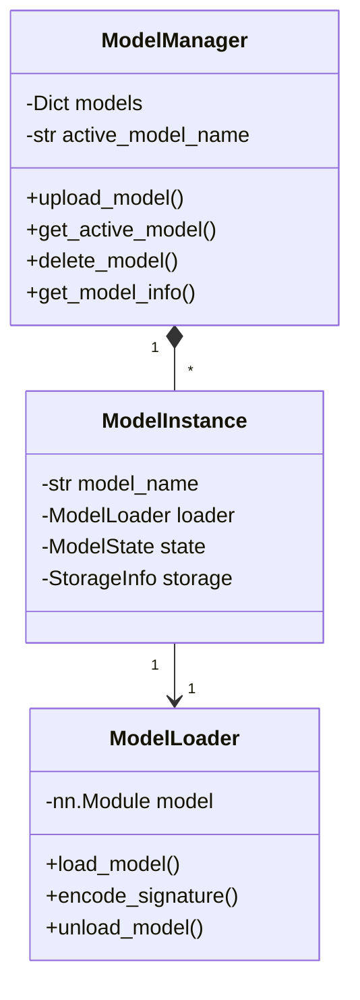

# Управление моделями

## Обзор

Inference хранит в Blob только **`models/{bundle_name}.zip`**. На диске Render — максимум **два** распакованных слота:

- `models/current/` — активная модель (forgery + `/about`)
- `models/previous/` — для `POST /model/rollback`

Старт: `MODEL_NAME` → list Blob → download zip → unpack `current/` → load RAM.

## Содержимое bundle (zip)

Один zip на модель, не пара `.pt` + `.py`:

| Файл | Роль |
|------|------|
| `manifest.json` | `feature_pipeline`, `verification.threshold`, опционально `anomaly` |
| `weights.pt` | Веса `SignatureEncoder` |
| `encoder.py` | Архитектура (динамический import) |
| `features.py` | Пайплайн признаков (синхрон с training) |
| `anomaly_params.npz` | mean / cov_inv / threshold (если `anomaly.enabled`) |

Сборка и имя zip (`NAME` в notebook): [MODEL_BUNDLE.md](../training/MODEL_BUNDLE.md).

## Архитектура



## Состояния модели

### ModelState

- **LOADING** - Модель загружается
- **READY** - Модель загружена и готова к использованию
- **ACTIVE** - Модель активна и обрабатывает запросы
- **UNLOADING** - Модель выгружается
- **ERROR** - Ошибка при загрузке модели

## Структура модели (в bundle)

1. **`weights.pt`** — checkpoint (`best_by_eer`)
2. **`encoder.py`** — класс `SignatureEncoder` (копия `model.py` из training run)
3. **`features.py`** — `apply_feature_pipeline` для inference
4. **`manifest.json`** — пороги и метаданные

Legacy-загрузка отдельных `.pt` + `.py` в корне `inference/models/` не используется для новых деплоев.

### Пример encoder.py

```python
import torch
import torch.nn as nn

class SignatureEncoder(nn.Module):
    def __init__(self, config):
        super().__init__()
        # Определение архитектуры
        ...
    
    def forward(self, x):
        # Forward pass
        ...
        return embedding
```

## Загрузка модели

### Через API

```bash
curl -X POST http://localhost:8000/model/upload \
  -F "model_name=sig-v4" \
  -F "bundle_file=@sig-v4.zip" \
  -F "activate=true" \
  -F "swap_strategy=zero_downtime"
```

### Процесс загрузки

1. **Валидация файлов** - Проверка формата и структуры
2. **Сохранение локально** - Сохранение в папку `models/`
3. **Загрузка в Blob Storage** (production) - Синхронизация с облачным хранилищем
4. **Hotswap** - Переключение на новую модель

## Hotswap стратегии

### Zero Downtime

**Описание**: Новая модель загружается параллельно со старой. После загрузки новая модель активируется, старая выгружается.

**Преимущества**:
- Нет прерывания обслуживания
- Плавное переключение

**Недостатки**:
- Временное использование дополнительной памяти
- Более сложная логика

**Последовательность**:
```
1. Старая модель активна → обрабатывает запросы
2. Новая модель загружается → параллельно
3. Новая модель готова → активируется
4. Старая модель выгружается → освобождает память
```

### Sequential

**Описание**: Старая модель сначала выгружается, затем загружается новая.

**Преимущества**:
- Простая логика
- Меньше использования памяти

**Недостатки**:
- Временное прерывание обслуживания
- Запросы могут быть отклонены во время переключения

**Последовательность**:
```
1. Старая модель активна → обрабатывает запросы
2. Старая модель выгружается → запросы отклоняются
3. Новая модель загружается → ожидание
4. Новая модель активируется → возобновление обслуживания
```

## Управление моделями

### Получение информации

```python
# Через API
GET /model/info

# Ответ
{
  "active_model": "v1",
  "models": {
    "v1": {
      "name": "v1",
      "state": "active",
      "is_active": true,
      "is_ready": true,
      "model_info": {...}
    }
  }
}
```

### Активация модели

```python
POST /model/activate
{
  "model_name": "v2"
}
```

### Удаление модели

```python
DELETE /model/delete
{
  "model_name": "v1"
}
```

**Ограничения**:
- Нельзя удалить активную модель
- Сначала нужно переключиться на другую модель

## Storage

### Local Storage (Development)

В development окружении модели хранятся локально в папке `models/`.

### Blob Storage (Production)

В production окружении модели синхронизируются с Vercel Blob Storage:

1. **Загрузка** - Модель загружается в Blob Storage
2. **Синхронизация** - При старте сервера модели синхронизируются из Blob Storage
3. **Кэширование** - Модели кэшируются локально для быстрого доступа

## Обработка ошибок

### Типичные ошибки

1. **Несовместимость архитектуры**
   ```
   Error: size mismatch
   ```
   Решение: Убедитесь, что .pt и .py файлы совместимы

2. **Отсутствие класса SignatureEncoder**
   ```
   Error: SignatureEncoder has no attribute
   ```
   Решение: Проверьте, что .py файл содержит класс SignatureEncoder

3. **Ошибка загрузки весов**
   ```
   Error: Error(s) in loading state_dict
   ```
   Решение: Проверьте совместимость структуры модели

## Логирование

Все операции с моделями логируются:

```python
logger.info(f"Loading model: {model_name}")
logger.info(f"Model {model_name} loaded successfully")
logger.error(f"Failed to load model {model_name}: {error}")
```

## Производительность

### Оптимизации

1. **Lazy Loading** - Модели загружаются только при необходимости
2. **Кэширование** - Загруженные модели остаются в памяти
3. **Параллельная загрузка** - Zero downtime стратегия позволяет загружать новую модель параллельно

### Ограничения

- Размер модели ограничен доступной памятью
- В serverless окружении есть ограничения по памяти
- Холодный старт может занять время для загрузки модели

## Best Practices

1. **Тестирование** - Всегда тестируйте модель перед загрузкой в production
2. **Версионирование** - Используйте понятные версии моделей (v1, v2, etc.)
3. **Резервные копии** - Храните резервные копии моделей
4. **Мониторинг** - Отслеживайте производительность и ошибки моделей
5. **Постепенное развертывание** - Используйте zero downtime стратегию для production

## Дополнительные ресурсы

- [API документация](API.md)
- [Предобработка](PREPROCESSING.md)
- [Развертывание](DEPLOYMENT.md)
- [Model bundle](../training/MODEL_BUNDLE.md)
- [Детектор аномалий](../training/ANOMALY_DETECTION.md)

