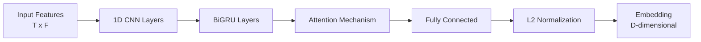

# Архитектура модели

## Обзор

SignatureEncoder - это нейронная сеть для создания эмбеддингов подписей. Архитектура состоит из CNN слоев, BiGRU, attention механизма и fully connected слоя.

## Архитектура



## Компоненты

### 1. CNN Layers (1D Convolution)

Извлечение локальных признаков из последовательности:

```python
self.cnn_layers = nn.ModuleList([
    nn.Conv1d(in_channels, out_channels, kernel_size, padding)
    for in_channels, out_channels in zip(channels, channels[1:])
])
```

**Параметры**:
- `conv_channels`: [64, 128, 256] - Количество каналов в каждом слое
- Kernel size: 3
- Padding: 1 (для сохранения длины)

### 2. BiGRU (Bidirectional GRU)

Обработка последовательности с учетом контекста в обоих направлениях:

```python
self.gru = nn.GRU(
    input_size=conv_output_size,
    hidden_size=gru_hidden,
    num_layers=gru_layers,
    bidirectional=True,
    batch_first=True
)
```

**Параметры**:
- `gru_hidden`: 256 - Размер скрытого состояния
- `gru_layers`: 3 - Количество слоев
- `bidirectional`: True - Двунаправленная обработка

### 3. Attention Mechanism

Взвешенная сумма выходов GRU:

```python
self.attention = nn.Linear(gru_hidden * 2, 1)  # *2 для bidirectional

# Вычисление весов
attention_weights = F.softmax(self.attention(gru_output), dim=1)
# Взвешенная сумма
output = torch.sum(attention_weights * gru_output, dim=1)
```

### 4. Fully Connected Layer

Преобразование в эмбеддинг:

```python
self.fc = nn.Linear(gru_hidden * 2, embedding_dim)
```

**Параметры**:
- `embedding_dim`: 256 - Размерность эмбеддинга

### 5. L2 Normalization

Нормализация эмбеддинга:

```python
embedding = F.normalize(embedding, p=2, dim=1)
```

## Полная архитектура

```python
class SignatureEncoder(nn.Module):
    def __init__(self, config):
        super().__init__()
        
        # CNN layers
        self.cnn_layers = nn.ModuleList([...])
        
        # BiGRU
        self.gru = nn.GRU(...)
        
        # Attention
        self.attention = nn.Linear(...)
        
        # FC
        self.fc = nn.Linear(...)
        
        # Dropout
        self.dropout = nn.Dropout(config.dropout)
    
    def forward(self, x):
        # x: [batch, T, F]
        
        # CNN
        x = x.transpose(1, 2)  # [batch, F, T]
        for cnn in self.cnn_layers:
            x = F.relu(cnn(x))
        x = x.transpose(1, 2)  # [batch, T, C]
        
        # BiGRU
        gru_output, _ = self.gru(x)  # [batch, T, H*2]
        
        # Attention
        attention_weights = F.softmax(
            self.attention(gru_output), dim=1
        )  # [batch, T, 1]
        attended = torch.sum(
            attention_weights * gru_output, dim=1
        )  # [batch, H*2]
        
        # FC
        embedding = self.fc(attended)  # [batch, D]
        
        # L2 Normalization
        embedding = F.normalize(embedding, p=2, dim=1)
        
        return embedding
```

## Параметры модели

### Конфигурация по умолчанию

```python
ModelConfig(
    name="hybrid",
    embedding_dim=256,
    cnn_channels=(64, 128, 256),
    gru_hidden=256,
    gru_layers=3,
    dropout=0.3
)
```

### Количество параметров

Примерно:
- CNN layers: ~500K параметров
- BiGRU: ~2M параметров
- Attention + FC: ~200K параметров
- **Всего**: ~2.7M параметров

## Loss функции

### Triplet Loss

```python
loss = max(0, margin + d(anchor, negative) - d(anchor, positive))
```

Где:
- `anchor` - Эмбеддинг оригинальной подписи
- `positive` - Эмбеддинг подписи того же пользователя
- `negative` - Эмбеддинг подписи другого пользователя
- `margin` - Порог разделения (0.3)

### Contrastive Loss

Альтернатива triplet loss для пар подписей.

## Обучение

### Оптимизатор

```python
optimizer = torch.optim.Adam(
    model.parameters(),
    lr=learning_rate,
    weight_decay=weight_decay
)
```

### Learning Rate Schedule

- Warmup: 3 эпохи с постепенным увеличением LR
- Основное обучение: Постоянный LR

### Gradient Clipping

```python
torch.nn.utils.clip_grad_norm_(model.parameters(), max_norm=0.5)
```

## Метрики

### EER (Equal Error Rate)

Точка, где False Acceptance Rate = False Rejection Rate.

### Accuracy

Процент правильных классификаций.

### Precision/Recall

Точность и полнота классификации.

## Экспорт модели

После обучения модель экспортируется:

1. **Checkpoint** (`.pt`):
   ```python
   torch.save({
       'model_state_dict': model.state_dict(),
       'config': config,
       'epoch': epoch,
       'metrics': metrics
   }, 'checkpoint.pt')
   ```

2. **Код модели** (`.py`):
   - Копия класса `SignatureEncoder`
   - Совместим с inference сервером

## Дополнительные ресурсы

- [Процесс обучения](TRAINING_PROCESS.md)
- [Датасет](DATASET.md)

