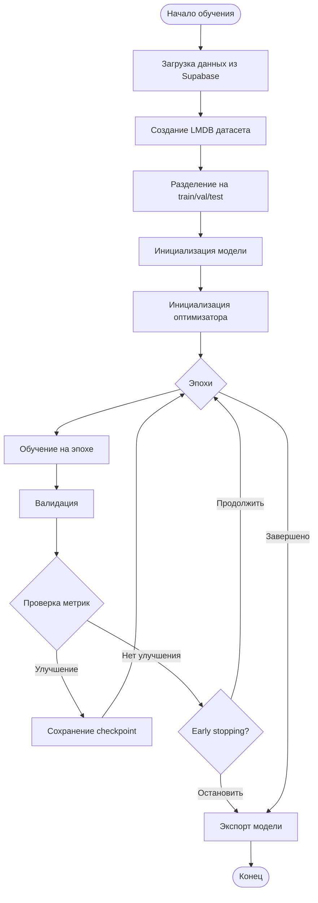

# Процесс обучения

## Обзор

Процесс обучения включает загрузку данных, инициализацию модели, цикл обучения с валидацией и сохранение результатов.

## Последовательность обучения



## Детальный процесс

### 1. Загрузка данных

```python
# Загрузка подписей из Supabase
genuine_signatures = load_genuine_signatures()
forged_signatures = load_forged_signatures()

# Фильтрация
if INPUT_TYPE != 'any':
    genuine_signatures = filter_by_input_type(genuine_signatures, INPUT_TYPE)
    forged_signatures = filter_by_input_type(forged_signatures, INPUT_TYPE)
```

### 2. Создание датасета

```python
# Создание LMDB
create_lmdb_dataset(genuine_signatures, forged_signatures, LMDB_PATH)

# Создание mapping
create_mapping_file(all_signatures, MAP_PATH)
```

### 3. Разделение данных

```python
if split_by_users:
    # Разделение по пользователям
    train_users, val_users, test_users = split_users(users, ratios)
    train_dataset = filter_by_users(dataset, train_users)
    val_dataset = filter_by_users(dataset, val_users)
    test_dataset = filter_by_users(dataset, test_users)
else:
    # Разделение по подписям
    train_dataset, val_dataset, test_dataset = split_dataset(dataset, ratios)
```

### 4. Инициализация модели

```python
model = SignatureEncoder(model_config)
model = model.to(device)

# Инициализация весов
initialize_weights(model)
```

### 5. Инициализация оптимизатора и loss

```python
optimizer = torch.optim.Adam(
    model.parameters(),
    lr=training_config.learning_rate,
    weight_decay=training_config.weight_decay
)

if training_config.loss_type == 'triplet':
    criterion = TripletLoss(margin=training_config.triplet_margin)
elif training_config.loss_type == 'contrastive':
    criterion = ContrastiveLoss(margin=training_config.triplet_margin)
```

### 6. Цикл обучения

```python
for epoch in range(training_config.epochs):
    # Обучение
    train_loss = train_epoch(model, train_loader, optimizer, criterion)
    
    # Валидация
    val_metrics = validate(model, val_loader)
    
    # Логирование
    log_metrics(epoch, train_loss, val_metrics)
    
    # Сохранение checkpoint
    if is_best(val_metrics):
        save_checkpoint(model, optimizer, epoch, val_metrics)
    
    # Early stopping
    if early_stopping(val_metrics):
        break
```

### 7. Обучение на эпохе

```python
def train_epoch(model, dataloader, optimizer, criterion):
    model.train()
    total_loss = 0
    
    for batch in dataloader:
        # Forward pass
        anchor_emb = model(batch['anchor'])
        positive_emb = model(batch['positive'])
        negative_emb = model(batch['negative'])
        
        # Loss
        loss = criterion(anchor_emb, positive_emb, negative_emb)
        
        # Backward pass
        optimizer.zero_grad()
        loss.backward()
        
        # Gradient clipping
        torch.nn.utils.clip_grad_norm_(model.parameters(), max_norm=0.5)
        
        optimizer.step()
        
        total_loss += loss.item()
    
    return total_loss / len(dataloader)
```

### 8. Валидация

```python
def validate(model, dataloader):
    model.eval()
    all_embeddings = []
    all_labels = []
    
    with torch.no_grad():
        for batch in dataloader:
            embeddings = model(batch['signatures'])
            all_embeddings.append(embeddings.cpu())
            all_labels.append(batch['labels'])
    
    # Вычисление метрик
    eer = calculate_eer(all_embeddings, all_labels)
    accuracy = calculate_accuracy(all_embeddings, all_labels)
    
    return {
        'eer': eer,
        'accuracy': accuracy
    }
```

### 9. Сохранение checkpoint

```python
def save_checkpoint(model, optimizer, epoch, metrics):
    checkpoint = {
        'epoch': epoch,
        'model_state_dict': model.state_dict(),
        'optimizer_state_dict': optimizer.state_dict(),
        'metrics': metrics,
        'config': config
    }
    
    # Сохранение best checkpoint
    torch.save(checkpoint, 'best_by_eer.pt')
    
    # Сохранение last checkpoint
    torch.save(checkpoint, 'last.pt')
```

### 10. Экспорт модели

```python
# Загрузка best checkpoint
checkpoint = torch.load('best_by_eer.pt')
model.load_state_dict(checkpoint['model_state_dict'])

# Экспорт весов
torch.save(model.state_dict(), 'model.pt')

# Экспорт кода модели
export_model_code(model, 'model.py')
```

## Конфигурация обучения

### Основные параметры

```python
TrainingConfig(
    epochs=20,
    learning_rate=0.0003,
    weight_decay=3e-05,
    mixed_precision=True,
    loss_type='triplet',
    triplet_margin=0.3,
    miner_type='batch_all',
    pk_p=8,  # Пользователей в батче
    pk_k=8,  # Подписей от каждого пользователя
    grad_accum_steps=2,
    early_stopping_patience=15,
    warmup_epochs=3
)
```

## Метрики и логирование

### Метрики

- **Training Loss** - Loss на обучающем наборе
- **Validation Loss** - Loss на валидационном наборе
- **EER** - Equal Error Rate
- **Accuracy** - Точность классификации

### Логирование

Метрики логируются в:
- CSV файл (`logs/epoch_metrics.csv`)
- TensorBoard (опционально)
- Console

## Early Stopping

Обучение останавливается, если:
- EER не улучшается в течение `early_stopping_patience` эпох
- Достигнуто максимальное количество эпох

## Дополнительные ресурсы

- [Датасет](DATASET.md)
- [Архитектура модели](MODEL_ARCHITECTURE.md)

